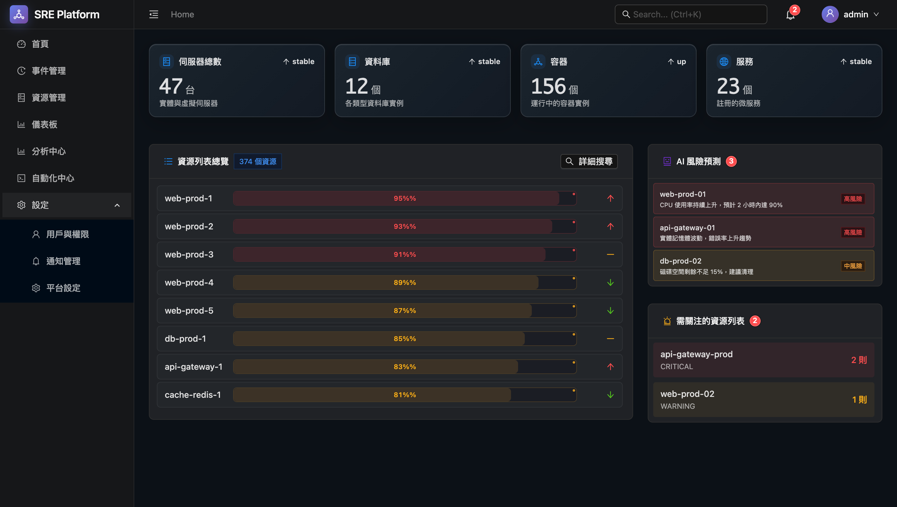

# SRE 平台 - 新一代自動化維運平台

[](https://reactjs.org/)
[](https://www.typescriptlang.org/)
[](https://golang.org/)
[](https://ant.design/)
[](https://echarts.apache.org/)
[](LICENSE)

> 🚀 **現代化 SRE 工作流程的智能化平台 - 從被動故障應對到主動系統管理的完美轉型**

這是一個**前後端分離架構**的 SRE 平台，包含完整的後端服務和前端應用程式，實現了 docs/specs.md 中定義的所有功能。

---

## 🎯 專案亮點

- **🧠 智能化診斷**: 提供可擴展的診斷引擎與自動化工作流程，支援AI驅動的根因分析
- **⚡ 零配置啟動**: 一鍵 `npm install` + `npm run dev` 完成環境設定
- **📊 全方位監控**: 整合 Prometheus、Loki、Grafana 構建完整可觀測性棧
- **🛡️ 企業級安全**: 基於 Keycloak 的 OIDC 認證系統，支援M2M服務間通訊
- **🎨 現代化 UI**: React + Ant Design 驅動的響應式介面，輕量且高效
- **🔧 開發友好**: 完整的 TypeScript 支援與熱重載，Vite 快速構建
- **🏗️ 統一管理層**: 作為「統一管理平面」(Unified Management Plane)，整合Grafana Alerting等開源工具
- **⚡ 自動化引擎**: 支持事件驅動、排程觸發、手動觸發、Webhook觸發四大自動化機制

## 互動原型體驗

我們提供了一個功能完整的互動原型，讓您無需安裝即可體驗平台的核心功能：

🌟 **[立即體驗 Live Demo](https://detectviz.github.io/sre-platform/prototype.html)**

### 📱 功能預覽





---

## 📖 目錄

- [專案簡介](#專案簡介)
- [核心架構](#核心架構)
- [技術棧](#技術棧)
- [快速入門](#快速入門)
- [功能展示](#功能展示)
- [開發指南](#開發指南)
- [專案結構](#專案結構)
- [詳細文件](#詳細文件)
- [部署說明](#部署說明)
- [貢獻指南](#貢獻指南)

---

## 專案簡介

SRE 平台是一個現代化的維運平台，專為企業級 SRE 團隊設計。作為「統一管理平面」(Unified Management Plane)，它整合 Grafana Alerting、Grafana OnCall 等開源工具，實現從傳統的被動故障應對模式向主動系統管理的革命性轉變。

本平台遵循 [Google SRE Book](https://sre.google/sre-book/) 的最佳實踐，主要參考章節：

- **[Chapter 4: Service Level Objectives](docs/google-sre-book/Chapter-04-Service-Level-Objectives.md)** - SLO/SLA 管理框架
- **[Chapter 6: Monitoring Distributed Systems](docs/google-sre-book/Chapter-06-Monitoring-Distributed-Systems.md)** - 四個黃金信號監控
- **[Chapter 7: The Evolution of Automation at Google](docs/google-sre-book/Chapter-07-The-Evolution-of-Automation-at-Google.md)** - 自動化哲學
- **[Chapter 14: Managing Incidents](docs/google-sre-book/Chapter-14-Managing-Incidents.md)** - 事件管理實踐

實現服務水準目標 (SLO) 管理、錯誤預算控制、四個黃金信號監控等核心功能。

### 🏗️ 核心組件

<table>
<tr>
<td width="50%">

**🎯 前端平台 (React + TypeScript)**
- **角色**: 現代化 Web UI 指揮中心
- **技術**: React 18 + TypeScript + Ant Design 5
- **職責**:
  - 統一的管理介面
  - 資源生命週期管理
  - 任務編排與調度
  - 使用者認證與授權

</td>
<td width="50%">

**🔧 後端服務 (Go)**
- **角色**: RESTful API 服務與智慧告警處理中樞
- **技術**: Go 1.21+ + Gin 框架 + GORM
- **職責**:
  - RESTful API 實現
  - 業務邏輯處理
  - 數據存儲與管理
  - 外部系統整合
  - AI Agent驅動的根因分析
  - 自動化修復與告警風暴總結

</td>
</tr>
</table>

### 🎨 設計理念


---

## 核心架構

### 🏛️ 整體架構圖


### 🔄 關鍵架構特性

- **📱 響應式設計**: 適配桌面、平板、行動設備
- **🔒 安全認證**: OIDC/OAuth2 整合 Keycloak
- **📊 實時監控**: 整合 Grafana 儀表板與告警
- **🔄 狀態管理**: Redux Toolkit 統一狀態管理
- **🎨 組件化**: 高可複用的 UI 組件設計
- **🏗️ 統一管理層**: 作為「統一管理平面」(Unified Management Plane)
- **🤖 智慧告警處理**: Webhook作為AI整合點，所有告警先經平台再分發
- **⚡ 自動化引擎**: 支持事件驅動、排程觸發、手動觸發、Webhook觸發四大機制

---

## 技術棧

### 🔧 後端框架
- **Go 1.21+** - 高性能、並發安全的後端語言
- **Gin** - 高性能的 HTTP Web 框架
- **GORM** - 全功能的 ORM 庫
- **Viper** - 配置管理
- **Zap** - 高性能結構化日誌記錄
- **OpenTelemetry** - 分散式追蹤、指標和日誌收集

### 🎨 前端框架
- **React 18** - 最新的 React 版本，提供更好的性能和開發體驗
- **TypeScript 5.0+** - 提供類型安全和更好的開發體驗
- **Ant Design 5** - 企業級 UI 組件庫，提供豐富的組件和設計語言
- **React Router 6** - 現代化的路由管理

### 📊 數據可視化
- **ECharts 5** - 強大的圖表庫，支持多種圖表類型
- **@ant-design/charts** - 基於 G2Plot 的 React 圖表組件

### 🏪 狀態管理與數據
- **Redux Toolkit** - 現代化的 Redux 狀態管理方案
- **React Query** - 強大的數據獲取和快取庫
- **Axios** - HTTP 客戶端，支持請求攔截和響應處理

### 🔍 前端觀測性
- **Sentry** - 前端錯誤追蹤和性能監控
- **OpenTelemetry JavaScript** - 前端追蹤和指標收集
- **Web Vitals** - 核心 Web 指標監控

### 🧪 測試工具
- **K6** - 高性能負載測試和性能監控
- **Jest** - JavaScript 測試框架
- **React Testing Library** - React 組件測試
- **Playwright** - 端到端測試框架

### 🛠️ 開發工具
- **Vite** - 快速的現代化構建工具
- **ESLint + Prettier** - 代碼規範和格式化
- **Husky + lint-staged** - Git 鉤子和代碼檢查

### 📦 其他依賴
- **Day.js** - 輕量級的日期處理庫
- **lodash** - 實用的 JavaScript 工具函數庫
- **clsx** - 條件性 CSS 類名工具

### 🔧 關鍵技術決策

#### 統一管理層架構
- **告警管理完全委託給 Grafana**：不自行實作告警規則判斷邏輯，專注於人員體驗
- **人員狀態管理完全委託給 Keycloak**：移除平台內人員狀態欄位，簡化管理介面
- **數據收集策略**：優先使用`node_exporter`進行深度監控，無法安裝時fallback到`snmp_exporter`

---

## 快速入門

### 🎯 環境要求

| 項目 | 版本要求 | 說明 |
|------|----------|------|
| **Go** | 1.21+ | 運行後端服務 |
| **Node.js** | 18.0+ | 運行 React 應用 |
| **npm** | 8.0+ | 前端包管理工具 |
| **Docker** | 20.0+ | 容器化部署 (可選) |
| **Git** | 2.0+ | 版本控制 |

### 🚀 一鍵啟動

#### 選項一：使用 Docker Compose (推薦)

```bash
# 📥 1. 下載專案
git clone https://github.com/detectviz/sre-platform
cd sre-platform

# 🚀 2. 一鍵啟動所有服務
docker-compose up -d

# ✅ 3. 訪問應用
# 前端: http://localhost:3001
# 後端 API: http://localhost:8080
# API 文檔: http://localhost:8080/swagger/index.html
```

#### 選項二：手動啟動 (開發環境)

```bash
# 📥 1. 下載專案
git clone https://github.com/detectviz/sre-platform
cd sre-platform

# 🔧 2. 啟動後端服務
cd backend
go mod download
go run main.go

# 🎨 3. 啟動前端應用 (新終端)
cd frontend
npm install
npm run dev

# ✅ 4. 訪問應用
# 前端: http://localhost:5173
# 後端 API: http://localhost:8080
```

### 🛠️ 常用指令

#### 前端指令
```bash
cd frontend

# 📊 開發服務器
npm run dev          # 啟動前端開發服務器
npm run build        # 構建生產版本
npm run preview      # 預覽生產版本

# 🧪 測試與檢查
npm run lint         # ESLint 代碼檢查
npm run lint:fix     # 自動修復 ESLint 錯誤
npm run format       # Prettier 代碼格式化
npm run test         # 運行單元測試
npm run test:e2e     # 運行端到端測試 (Playwright)

# 🔍 性能測試 (K6)
k6 run tests/performance/load-test.js    # 運行負載測試
k6 run --out json=results.json tests/performance/load-test.js  # 輸出測試結果

# 🔧 其他工具
npm run clean        # 清理快取和構建文件
npm run analyze      # 分析包大小
```

#### 後端指令
```bash
cd backend

# 🔧 開發與構建
go run main.go        # 啟動開發服務器
go build -o bin/app   # 構建二進制檔案
go mod tidy           # 整理依賴
go mod download       # 下載依賴

# 🧪 測試
go test ./...         # 運行所有測試
go test -v ./internal/api  # 運行 API 測試

# 📚 文檔
swag init            # 生成 Swagger 文檔
```

#### Docker 指令
```bash
# 構建和運行
docker-compose up -d                 # 啟動所有服務
docker-compose up -d backend         # 只啟動後端
docker-compose up -d frontend        # 只啟動前端

# 開發環境
docker-compose -f docker-compose.dev.yml up -d  # 開發環境配置
docker-compose logs -f backend       # 查看後端日誌
docker-compose logs -f frontend      # 查看前端日誌
```

---

## 功能展示

### 📱 核心功能預覽

<table>
<tr>
<td width="33%">

**🎯 資源管理**
- 統一的基礎設施視圖
- 批次操作與網段掃描
- 即時狀態監控
- 智能分組管理

</td>
<td width="33%">

**🚨 智能告警**
- AI 驅動的根因分析
- 自動化修復建議
- 告警關聯與去重
- 結構化事件報告

</td>
<td width="33%">

**📊 容量規劃**
- 基於機器學習的預測
- 多維度趨勢分析
- 主動容量建議
- 成本優化建議

</td>
</tr>
</table>

### 🎯 分階段實施策略

#### Phase 1：監控與洞察核心 (當前)
- ✅ SRE主頁儀表板
- ✅ 資源列表與Top N資源列表
- ✅ 告警列表
- ✅ AI分析彈窗(唯讀版)

#### Phase 2：響應與協作整合 (未來)
- 🚀 查看Runbook功能
- 🚀 創建工單功能
- 🚀 其他系統整合

### 🔥 核心工作流程演示


---

## 開發指南

### 📂 專案結構

```
sre-platform/
├── 📁 backend/                  # Go 後端服務
│   ├── 📁 cmd/                  # 應用入口
│   ├── 📁 internal/             # 私有應用程式和庫代碼
│   │   ├── 📁 api/              # API 路由和處理器
│   │   ├── 📁 models/           # 數據模型
│   │   ├── 📁 services/         # 業務邏輯服務
│   │   └── 📁 middleware/       # 中間件
│   ├── 📁 pkg/                  # 可重用的庫代碼
│   ├── 📁 configs/              # 配置檔案
│   ├── 📁 migrations/           # 數據庫遷移
│   ├── 📁 docs/                 # API 文檔
│   ├── go.mod                   # Go 模組定義
│   ├── go.sum                   # Go 依賴校驗和
│   └── main.go                  # 應用程式入口
│
├── 📁 frontend/                 # React 前端應用
│   ├── 📁 public/               # 靜態資源
│   ├── 📁 src/
│   │   ├── 📁 components/       # 可複用組件
│   │   │   ├── common/          # 通用組件
│   │   │   └── layout/          # 佈局組件
│   │   ├── 📁 pages/            # 頁面組件
│   │   │   ├── dashboard/       # 儀表板頁面
│   │   │   ├── resources/       # 資源管理頁面
│   │   │   ├── incidents/       # 事件管理頁面
│   │   │   └── settings/        # 設定頁面
│   │   ├── 📁 features/         # 功能模組
│   │   │   ├── auth/            # 認證功能
│   │   │   ├── monitoring/      # 監控功能
│   │   │   └── notifications/   # 通知功能
│   │   ├── 📁 hooks/            # 自訂 React Hooks
│   │   ├── 📁 utils/            # 工具函數
│   │   ├── 📁 types/            # TypeScript 類型定義
│   │   ├── 📁 constants/        # 常量定義
│   │   ├── 📁 services/         # API 服務
│   │   ├── 📁 store/            # Redux 狀態管理
│   │   ├── 📁 styles/           # 全局樣式
│   │   ├── App.tsx              # 應用入口
│   │   └── main.tsx             # React 入口
│   ├── 📁 docs/                 # 前端文檔
│   ├── package.json             # 前端項目配置
│   ├── tsconfig.json            # TypeScript 配置
│   ├── vite.config.ts           # Vite 配置
│   └── tailwind.config.js       # Tailwind CSS 配置
│
├── 📁 docs/                     # 專案整體文檔
│   ├── 📁 architecture/         # 架構設計文檔
│   ├── 📁 api/                  # API 規範文檔
│   ├── 📁 development/          # 開發指南
│   └── 📁 ui/                   # UI/UX 設計規範
│
├── 📁 docker/                   # Docker 配置
│   ├── 📁 backend/              # 後端 Docker 配置
│   ├── 📁 frontend/             # 前端 Docker 配置
│   └── docker-compose.yml       # 完整應用程式編排
│
├── 📁 scripts/                  # 部署和構建腳本
├── 📁 .github/                  # GitHub Actions 配置
├── go.work                      # Go workspace 配置
└── README.md                    # 專案總體說明
```

### 📝 開發規範

**🎯 代碼規範**：
- **TypeScript**: 強類型檢查，禁止使用 `any` 類型
- **React**: 使用函數組件 + Hooks，避免類組件
- **組件**: 使用小寫字母開頭，PascalCase 命名
- **文件**: 使用 kebab-case 命名

**📋 Commit 訊息範例**：
```
feat: 新增資源詳情頁面組件
fix: 修復圖表渲染錯誤
docs: 更新組件使用文檔
test: 增加資源列表單元測試
refactor: 重構狀態管理邏輯
```

---

## 詳細文件

我們提供了完整的文件體系，涵蓋使用、開發、架構等各個層面：

### 📚 核心文件

| 文件 | 目標讀者 | 內容概述 | 狀態 |
|------|----------|----------|------|
| **[📋 架構設計書](docs/architecture.md)** | 技術架構師、開發者 | 系統架構、設計理念、技術選型、重要決策 | ✅ 已完成 |
| **[🎯 使用者指南](docs/specs.md)** | SRE 工程師、運維人員 | 功能說明、操作指南、互動原型 | ✅ 已完成 |
| **[🛠️ 開發總規劃](docs/development.md)** | 專案經理、開發團隊 | 開發階段、任務規劃、里程碑 | ✅ 已完成 |
| **[🎨 UI/UX 設計指南](pages.md#-uiux-設計原則與規範)** | UI/UX 設計師、前端開發者 | 統一的設計規範、組件使用指南、優化建議 | ✅ 已整合 |
| **[🤖 AI代理指南](AGENT.md)** | AI 開發者、代理系統 | AI 代理操作指南、自動化流程 | ✅ 已完成 |
| **[📊 數據庫設計](db_schema.sql)** | 數據庫工程師、後端開發者 | 完整的數據模型、索引策略、性能優化 | ✅ 已完成 |
| **[🔌 API 規範](openapi.yaml)** | API 開發者、集成工程師 | RESTful API 定義、請求響應格式 | ✅ 已完成 |
| **[📱 頁面分析](pages.md)** | 產品經理、UI/UX 設計師 | 92 個頁面的詳細功能分析和優化建議 | ✅ 已完成 |

### 📖 專業文件

| 文件 | 內容概述 | 狀態 |
|------|----------|------|
| **[🎨 設計審閱合集](pages.md)** | 各模塊設計分析與優化建議 | ✅ 已整合 |
| **[📋 API 設計](openapi.yaml)** | API 架構設計和最佳實踐 | ✅ 已完成 |
| **[🏗️ 後端架構計劃](docs/architecture.md)** | 後端系統架構規劃 | ✅ 已整合 |
| **[🗺️ 網站地圖](pages.md#-導航結構)** | 完整的功能頁面結構 | ✅ 已整合 |
| **[📄 頁面參數](pages.md)** | 頁面參數設計規範 | ✅ 已整合 |
| **[🎯 智能輸入實作](pages.md#-編輯通知策略1)** | 智能輸入組件實作指南 | ✅ 已整合 |
| **[🔒 安全配置指南](docs/SECURITY.md)** | 認證、授權、加密配置 | ✅ 已完成 |
| **[📈 監控與告警](docs/MONITORING.md)** | 可觀測性最佳實踐 | ✅ 已完成 |
| **[🚀 部署指南](docs/DEPLOYMENT.md)** | 生產環境部署說明 | ⚠️ 待創建 |
| **[🔧 故障排除](docs/TROUBLESHOOTING.md)** | 常見問題與解決方案 | ⚠️ 待創建 |
| **[⚡ 性能調優](docs/PERFORMANCE.md)** | 性能優化指南 | ⚠️ 待創建 |

### 📚 參考資源

| 文件 | 內容概述 | 狀態 |
|------|----------|------|
| **[🎓 Google SRE Book 參考指南](docs/google-sre-book/REFERENCES.md)** | 本平台設計參考的核心理念和實踐 | ✅ 已完成 |
| **[📖 完整 SRE Book 章節](docs/google-sre-book/)** | 34 個完整章節的深度分析 | ✅ 已完成 |

---

## 部署說明

### 🐳 Docker 部署

```bash
# 構建 Docker 鏡像
docker build -t sre-platform .

# 運行容器
docker run -p 80:80 sre-platform
```

### ☁️ 雲端部署

- **Vercel**: 推薦用於靜態部署
- **Netlify**: 支持 CDN 和表單處理
- **AWS S3 + CloudFront**: 企業級部署方案

### 🔧 環境變數

```bash
# .env 檔案範例
VITE_API_BASE_URL=https://api.your-domain.com
VITE_GRAFANA_URL=https://grafana.your-domain.com
VITE_KEYCLOAK_URL=https://keycloak.your-domain.com
```

---

## 貢獻指南

### 🏃‍♂️ 本地開發設定

1. Fork 此專案
2. 建立功能分支: `git checkout -b feature/amazing-feature`
3. 提交變更: `git commit -m 'Add amazing feature'`
4. 推送分支: `git push origin feature/amazing-feature`
5. 開啟 Pull Request

### 📋 貢獻規範

- 所有新功能都需要對應的測試
- 確保通過所有 ESLint 和 TypeScript 檢查
- 更新相關文檔
- 遵循現有的代碼風格

### 🐛 問題回報

發現 Bug 或有功能建議？歡迎：

1. 檢查 [Issues](../../issues) 是否已有相關問題
2. 如果沒有，建立新的 Issue
3. 提供詳細的問題描述和重現步驟

---

## 📄 授權

本專案採用 Apache License 2.0 授權 - 詳見 [LICENSE](LICENSE) 文件

---

## 🙏 致謝

感謝所有為此專案做出貢獻的開發者和使用者！

特別感謝：
- [React](https://reactjs.org/) 團隊提供的優秀前端框架
- [Ant Design](https://ant.design/) 團隊提供的企業級 UI 組件
- [ECharts](https://echarts.apache.org/) 團隊提供的數據可視化工具