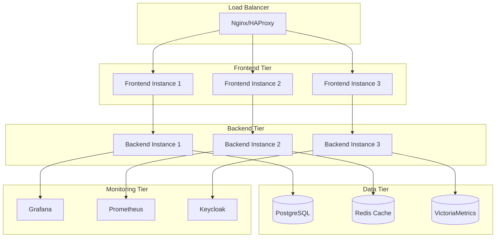

# 🚀 SRE 平台部署指南

## 📋 目錄
- [部署概述](#部署概述)
- [系統要求](#系統要求)
- [環境配置](#環境配置)
- [本地開發環境](#本地開發環境)
- [生產環境部署](#生產環境部署)
- [容器化部署](#容器化部署)
- [雲端部署](#雲端部署)
- [監控與運維](#監控與運維)
- [故障排除](#故障排除)

---

## 📋 核心契約文件參考 (SSOT)
所有部署配置必須符合以下契約規範：
- **[../openapi.yaml](../openapi.yaml)** - API 服務端點和認證規範
- **[../db_schema.sql](../db_schema.sql)** - 數據庫初始化和遷移腳本
- **[../TODO.md](../TODO.md)** - 前端實作狀態和 Mock Server 配置

## 部署概述

SRE 平台採用現代化的微服務架構，支持多種部署模式：

- **本地開發**: 快速開發和測試
- **Docker 容器化**: 標準化運行環境
- **Kubernetes**: 生產級別的容器編排
- **雲端部署**: 支持 AWS、Azure、GCP 等主流雲平台

### 🏗️ 部署架構圖



---

## 系統要求

### 🔧 硬體要求

#### 最低配置（開發環境）
| 組件 | CPU | 記憶體 | 存儲 | 網路 |
|------|-----|--------|------|------|
| **前端服務** | 1 vCPU | 1GB | 10GB | 100Mbps |
| **後端服務** | 2 vCPU | 4GB | 20GB | 1Gbps |
| **資料庫** | 2 vCPU | 4GB | 50GB SSD | 1Gbps |
| **監控堆疊** | 2 vCPU | 4GB | 100GB | 1Gbps |

#### 生產環境建議配置
| 組件 | CPU | 記憶體 | 存儲 | 網路 |
|------|-----|--------|------|------|
| **前端服務** | 4 vCPU | 8GB | 50GB | 10Gbps |
| **後端服務** | 8 vCPU | 16GB | 100GB SSD | 10Gbps |
| **資料庫** | 16 vCPU | 32GB | 500GB NVMe | 25Gbps |
| **監控堆疊** | 8 vCPU | 16GB | 1TB SSD | 10Gbps |

### 💻 軟體要求

#### 核心依賴
- **Docker** >= 20.10
- **Docker Compose** >= 2.0
- **Kubernetes** >= 1.24 (生產環境)
- **Helm** >= 3.8 (K8s 部署)

#### 開發依賴
- **Go** >= 1.21
- **Node.js** >= 18.0
- **npm** >= 8.0
- **Git** >= 2.30

---

## 環境配置

### 🔐 環境變數配置

#### 後端環境變數
```bash
# 基本配置
APP_ENV=production
APP_PORT=8080
APP_DEBUG=false

# 資料庫配置
DB_HOST=postgresql.example.com
DB_PORT=5432
DB_NAME=sre_platform
DB_USER=sre_user
DB_PASSWORD=secure_password_123
DB_SSL_MODE=require

# Redis 配置
REDIS_HOST=redis.example.com
REDIS_PORT=6379
REDIS_PASSWORD=redis_password_123
REDIS_DB=0

# 認證配置
KEYCLOAK_URL=https://auth.example.com
KEYCLOAK_REALM=sre-platform
KEYCLOAK_CLIENT_ID=sre-platform-client
KEYCLOAK_CLIENT_SECRET=client_secret_123

# Grafana 整合
GRAFANA_URL=https://grafana.example.com
GRAFANA_API_KEY=grafana_api_key_123

# 監控配置
PROMETHEUS_URL=https://prometheus.example.com
VICTORIA_METRICS_URL=https://vm.example.com

# 安全配置
JWT_SECRET=jwt_secret_key_256_bits
API_SECRET=api_secret_key_256_bits
```

#### 前端環境變數
```bash
# API 端點
VITE_API_BASE_URL=https://api.sre-platform.example.com
VITE_WS_BASE_URL=wss://ws.sre-platform.example.com

# 外部服務
VITE_GRAFANA_URL=https://grafana.example.com
VITE_KEYCLOAK_URL=https://auth.example.com
VITE_KEYCLOAK_REALM=sre-platform
VITE_KEYCLOAK_CLIENT_ID=sre-platform-frontend

# 功能開關
VITE_ENABLE_DEBUG=false
VITE_ENABLE_MOCK=false
VITE_ENABLE_TELEMETRY=true

# CDN 配置
VITE_CDN_URL=https://cdn.example.com
VITE_ASSETS_BASE_URL=/assets/
```

---

## 本地開發環境

### 🎯 快速啟動

#### 使用 Docker Compose（推薦）

```bash
# 1. 克隆專案
git clone https://github.com/your-org/sre-platform
cd sre-platform

# 2. 複製環境配置
cp .env.example .env
cp frontend/.env.example frontend/.env.local

# 3. 啟動所有服務
docker-compose -f docker-compose.dev.yml up -d

# 4. 檢查服務狀態
docker-compose ps

# 5. 訪問應用
echo "Frontend: http://localhost:3000"
echo "Backend API: http://localhost:8080"
echo "API 文檔: http://localhost:8080/swagger/"
echo "Grafana: http://localhost:3001"
echo "Keycloak: http://localhost:8081"
```

#### 手動啟動（開發者模式）

```bash
# 1. 啟動依賴服務
docker-compose -f docker-compose.deps.yml up -d

# 2. 後端服務
cd backend
go mod download
go run main.go

# 3. 前端服務（新終端）
cd frontend
npm install
npm run dev

# 4. 數據庫遷移
cd backend
go run cmd/migrate/main.go up
```

### 🧪 開發工具

#### API 測試
```bash
# 使用 curl 測試 API
curl -X GET "http://localhost:8080/api/v1/health" \
  -H "Accept: application/json"

# 使用 HTTPie
http GET localhost:8080/api/v1/resources \
  Authorization:"Bearer $TOKEN"
```

#### 資料庫管理
```bash
# 連接到開發資料庫
docker exec -it sre_postgres psql -U sre_user -d sre_platform

# 查看表結構
\dt

# 執行查詢
SELECT * FROM resources LIMIT 10;
```

---

## 生產環境部署

### 🏭 準備工作

#### 1. 基礎設施準備
```bash
# 創建專用用戶
sudo useradd -m -s /bin/bash sre-platform
sudo usermod -aG docker sre-platform

# 創建目錄結構
sudo mkdir -p /opt/sre-platform/{data,logs,configs,backups}
sudo chown -R sre-platform:sre-platform /opt/sre-platform

# 安全配置
sudo ufw allow 80/tcp
sudo ufw allow 443/tcp
sudo ufw allow 22/tcp
sudo ufw enable
```

#### 2. SSL 證書配置
```bash
# 使用 Let's Encrypt
sudo certbot certonly --nginx \
  -d api.sre-platform.example.com \
  -d app.sre-platform.example.com

# 證書自動續期
sudo crontab -e
# 新增：0 12 * * * /usr/bin/certbot renew --quiet
```

### 🚀 部署腳本

#### 生產部署腳本
```bash
#!/bin/bash
# deploy.sh - 生產環境部署腳本

set -euo pipefail

PROJECT_DIR="/opt/sre-platform"
BACKUP_DIR="$PROJECT_DIR/backups"
CONFIG_DIR="$PROJECT_DIR/configs"

echo "🚀 開始 SRE 平台生產部署..."

# 1. 備份現有數據
echo "📦 創建備份..."
timestamp=$(date +%Y%m%d_%H%M%S)
docker exec sre_postgres pg_dump -U sre_user sre_platform > \
  "$BACKUP_DIR/database_$timestamp.sql"

# 2. 更新程式碼
echo "📥 更新程式碼..."
git fetch --all
git reset --hard origin/main

# 3. 構建映像檔
echo "🔨 構建應用映像檔..."
docker build -t sre-platform/backend:latest ./backend
docker build -t sre-platform/frontend:latest ./frontend

# 4. 停止舊服務
echo "🛑 停止舊服務..."
docker-compose -f docker-compose.prod.yml down

# 5. 數據庫遷移
echo "🗄️ 執行數據庫遷移..."
docker run --rm --network sre-platform_default \
  -v "$CONFIG_DIR:/configs" \
  sre-platform/backend:latest \
  /app/migrate up

# 6. 啟動新服務
echo "▶️ 啟動服務..."
docker-compose -f docker-compose.prod.yml up -d

# 7. 健康檢查
echo "🏥 執行健康檢查..."
sleep 30
./scripts/health-check.sh

echo "✅ 部署完成！"
```

#### 健康檢查腳本
```bash
#!/bin/bash
# health-check.sh - 服務健康檢查

API_URL="https://api.sre-platform.example.com"
FRONTEND_URL="https://app.sre-platform.example.com"

# 後端健康檢查
echo "🔍 檢查後端服務..."
response=$(curl -s -o /dev/null -w "%{http_code}" "$API_URL/health")
if [ "$response" -eq 200 ]; then
    echo "✅ 後端服務正常"
else
    echo "❌ 後端服務異常 (HTTP $response)"
    exit 1
fi

# 前端健康檢查
echo "🔍 檢查前端服務..."
response=$(curl -s -o /dev/null -w "%{http_code}" "$FRONTEND_URL")
if [ "$response" -eq 200 ]; then
    echo "✅ 前端服務正常"
else
    echo "❌ 前端服務異常 (HTTP $response)"
    exit 1
fi

echo "🎉 所有服務健康檢查通過！"
```

---

## 容器化部署

### 🐳 Docker Compose 配置

#### 生產環境 docker-compose.prod.yml
```yaml
version: '3.8'

services:
  # 前端服務
  frontend:
    image: sre-platform/frontend:latest
    container_name: sre_frontend
    restart: unless-stopped
    ports:
      - "3000:80"
    environment:
      - NODE_ENV=production
    volumes:
      - ./configs/nginx.conf:/etc/nginx/nginx.conf:ro
    networks:
      - sre-network
    depends_on:
      - backend

  # 後端服務
  backend:
    image: sre-platform/backend:latest
    container_name: sre_backend
    restart: unless-stopped
    ports:
      - "8080:8080"
    env_file:
      - .env.production
    volumes:
      - ./logs:/app/logs
      - ./configs:/app/configs:ro
    networks:
      - sre-network
    depends_on:
      - postgres
      - redis
    healthcheck:
      test: ["CMD", "curl", "-f", "http://localhost:8080/health"]
      interval: 30s
      timeout: 10s
      retries: 3

  # PostgreSQL 資料庫
  postgres:
    image: postgres:15-alpine
    container_name: sre_postgres
    restart: unless-stopped
    environment:
      - POSTGRES_DB=sre_platform
      - POSTGRES_USER=sre_user
      - POSTGRES_PASSWORD_FILE=/run/secrets/postgres_password
    volumes:
      - postgres_data:/var/lib/postgresql/data
      - ./configs/postgresql.conf:/etc/postgresql/postgresql.conf:ro
      - ./backups:/backups
    networks:
      - sre-network
    secrets:
      - postgres_password
    command: >
      postgres
      -c config_file=/etc/postgresql/postgresql.conf
      -c log_statement=all
      -c log_duration=on

  # Redis 快取
  redis:
    image: redis:7-alpine
    container_name: sre_redis
    restart: unless-stopped
    volumes:
      - redis_data:/data
      - ./configs/redis.conf:/etc/redis/redis.conf:ro
    networks:
      - sre-network
    command: redis-server /etc/redis/redis.conf

  # Nginx 反向代理
  nginx:
    image: nginx:alpine
    container_name: sre_nginx
    restart: unless-stopped
    ports:
      - "80:80"
      - "443:443"
    volumes:
      - ./configs/nginx:/etc/nginx/conf.d:ro
      - ./ssl:/etc/ssl/certs:ro
      - ./logs/nginx:/var/log/nginx
    networks:
      - sre-network
    depends_on:
      - frontend
      - backend

volumes:
  postgres_data:
    driver: local
  redis_data:
    driver: local

networks:
  sre-network:
    driver: bridge

secrets:
  postgres_password:
    file: ./secrets/postgres_password.txt
```

### 📝 Nginx 配置

#### configs/nginx/sre-platform.conf
```nginx
# SRE 平台 Nginx 配置

# 速率限制
limit_req_zone $binary_remote_addr zone=api:10m rate=10r/s;
limit_req_zone $binary_remote_addr zone=auth:10m rate=5r/s;

# 上游服務
upstream backend {
    least_conn;
    server backend:8080 max_fails=3 fail_timeout=30s;
    keepalive 32;
}

upstream frontend {
    least_conn;
    server frontend:80 max_fails=3 fail_timeout=30s;
    keepalive 32;
}

# HTTPS 重定向
server {
    listen 80;
    server_name app.sre-platform.example.com api.sre-platform.example.com;
    return 301 https://$server_name$request_uri;
}

# 前端服務
server {
    listen 443 ssl http2;
    server_name app.sre-platform.example.com;

    # SSL 配置
    ssl_certificate /etc/ssl/certs/sre-platform.crt;
    ssl_certificate_key /etc/ssl/certs/sre-platform.key;
    ssl_protocols TLSv1.2 TLSv1.3;
    ssl_ciphers ECDHE-RSA-AES128-GCM-SHA256:ECDHE-RSA-AES256-GCM-SHA384;
    ssl_prefer_server_ciphers off;

    # 安全標頭
    add_header X-Frame-Options SAMEORIGIN;
    add_header X-Content-Type-Options nosniff;
    add_header X-XSS-Protection "1; mode=block";
    add_header Strict-Transport-Security "max-age=31536000; includeSubDomains" always;

    # Gzip 壓縮
    gzip on;
    gzip_vary on;
    gzip_min_length 1024;
    gzip_types text/css text/javascript application/javascript application/json;

    location / {
        proxy_pass http://frontend;
        proxy_set_header Host $host;
        proxy_set_header X-Real-IP $remote_addr;
        proxy_set_header X-Forwarded-For $proxy_add_x_forwarded_for;
        proxy_set_header X-Forwarded-Proto $scheme;
    }

    # 靜態資源緩存
    location ~* \.(js|css|png|jpg|jpeg|gif|ico|svg|woff|woff2|ttf|eot)$ {
        proxy_pass http://frontend;
        expires 1y;
        add_header Cache-Control "public, immutable";
    }
}

# 後端 API 服務
server {
    listen 443 ssl http2;
    server_name api.sre-platform.example.com;

    # SSL 配置（同上）
    ssl_certificate /etc/ssl/certs/sre-platform.crt;
    ssl_certificate_key /etc/ssl/certs/sre-platform.key;
    ssl_protocols TLSv1.2 TLSv1.3;
    ssl_ciphers ECDHE-RSA-AES128-GCM-SHA256:ECDHE-RSA-AES256-GCM-SHA384;

    # API 速率限制
    location /api/ {
        limit_req zone=api burst=20 nodelay;

        proxy_pass http://backend;
        proxy_set_header Host $host;
        proxy_set_header X-Real-IP $remote_addr;
        proxy_set_header X-Forwarded-For $proxy_add_x_forwarded_for;
        proxy_set_header X-Forwarded-Proto $scheme;

        # API 特定配置
        proxy_connect_timeout 5s;
        proxy_send_timeout 30s;
        proxy_read_timeout 30s;
    }

    # 認證端點特殊限制
    location /api/auth/ {
        limit_req zone=auth burst=10 nodelay;
        proxy_pass http://backend;
        # ... 其他代理設置
    }

    # WebSocket 支持
    location /ws/ {
        proxy_pass http://backend;
        proxy_http_version 1.1;
        proxy_set_header Upgrade $http_upgrade;
        proxy_set_header Connection "upgrade";
        proxy_set_header Host $host;
    }
}
```

---

## 雲端部署

### ☁️ AWS 部署

#### ECS Fargate 部署
```yaml
# ecs-task-definition.json
{
  "family": "sre-platform",
  "networkMode": "awsvpc",
  "requiresCompatibilities": ["FARGATE"],
  "cpu": "1024",
  "memory": "2048",
  "executionRoleArn": "arn:aws:iam::ACCOUNT:role/ecsTaskExecutionRole",
  "taskRoleArn": "arn:aws:iam::ACCOUNT:role/ecsTaskRole",
  "containerDefinitions": [
    {
      "name": "backend",
      "image": "your-account.dkr.ecr.region.amazonaws.com/sre-platform/backend:latest",
      "essential": true,
      "portMappings": [
        {
          "containerPort": 8080,
          "protocol": "tcp"
        }
      ],
      "environment": [
        {
          "name": "APP_ENV",
          "value": "production"
        }
      ],
      "secrets": [
        {
          "name": "DB_PASSWORD",
          "valueFrom": "arn:aws:secretsmanager:region:ACCOUNT:secret:sre-platform/db-password"
        }
      ],
      "logConfiguration": {
        "logDriver": "awslogs",
        "options": {
          "awslogs-group": "/aws/ecs/sre-platform",
          "awslogs-region": "us-west-2",
          "awslogs-stream-prefix": "ecs"
        }
      }
    }
  ]
}
```

#### Terraform 基礎設施
```hcl
# main.tf
provider "aws" {
  region = var.aws_region
}

# VPC 配置
module "vpc" {
  source = "terraform-aws-modules/vpc/aws"

  name = "sre-platform-vpc"
  cidr = "10.0.0.0/16"

  azs             = ["${var.aws_region}a", "${var.aws_region}b", "${var.aws_region}c"]
  private_subnets = ["10.0.1.0/24", "10.0.2.0/24", "10.0.3.0/24"]
  public_subnets  = ["10.0.101.0/24", "10.0.102.0/24", "10.0.103.0/24"]

  enable_nat_gateway = true
  enable_vpn_gateway = true

  tags = {
    Environment = var.environment
    Project     = "sre-platform"
  }
}

# RDS PostgreSQL
resource "aws_db_instance" "postgres" {
  identifier = "sre-platform-postgres"

  engine         = "postgres"
  engine_version = "15.3"
  instance_class = "db.t3.medium"

  allocated_storage     = 100
  max_allocated_storage = 1000
  storage_encrypted     = true

  db_name  = "sre_platform"
  username = "sre_user"
  password = random_password.db_password.result

  vpc_security_group_ids = [aws_security_group.rds.id]
  db_subnet_group_name   = aws_db_subnet_group.postgres.name

  backup_retention_period = 30
  backup_window          = "03:00-04:00"
  maintenance_window     = "sun:04:00-sun:05:00"

  deletion_protection = true

  tags = {
    Environment = var.environment
    Project     = "sre-platform"
  }
}

# ElastiCache Redis
resource "aws_elasticache_subnet_group" "redis" {
  name       = "sre-platform-redis"
  subnet_ids = module.vpc.private_subnets
}

resource "aws_elasticache_replication_group" "redis" {
  replication_group_id    = "sre-platform-redis"
  description             = "Redis cluster for SRE Platform"

  node_type               = "cache.t3.micro"
  port                    = 6379
  parameter_group_name    = "default.redis7"

  num_cache_clusters      = 2
  automatic_failover_enabled = true
  multi_az_enabled        = true

  subnet_group_name       = aws_elasticache_subnet_group.redis.name
  security_group_ids      = [aws_security_group.redis.id]

  at_rest_encryption_enabled = true
  transit_encryption_enabled = true

  tags = {
    Environment = var.environment
    Project     = "sre-platform"
  }
}
```

### 🚀 Kubernetes 部署

#### Helm Chart 配置
```yaml
# charts/sre-platform/values.yaml
# 全局配置
global:
  namespace: sre-platform
  environment: production
  imageRegistry: your-registry.com
  imageTag: "latest"

# 前端配置
frontend:
  enabled: true
  replicaCount: 3
  image:
    repository: sre-platform/frontend
    tag: ""  # 使用 global.imageTag
    pullPolicy: IfNotPresent

  service:
    type: ClusterIP
    port: 80
    targetPort: 80

  ingress:
    enabled: true
    className: "nginx"
    annotations:
      cert-manager.io/cluster-issuer: "letsencrypt-prod"
      nginx.ingress.kubernetes.io/ssl-redirect: "true"
    hosts:
      - host: app.sre-platform.example.com
        paths:
          - path: /
            pathType: Prefix
    tls:
      - secretName: sre-platform-frontend-tls
        hosts:
          - app.sre-platform.example.com

  resources:
    limits:
      cpu: 500m
      memory: 512Mi
    requests:
      cpu: 100m
      memory: 128Mi

  autoscaling:
    enabled: true
    minReplicas: 3
    maxReplicas: 10
    targetCPUUtilizationPercentage: 70
    targetMemoryUtilizationPercentage: 80

# 後端配置
backend:
  enabled: true
  replicaCount: 3
  image:
    repository: sre-platform/backend
    tag: ""
    pullPolicy: IfNotPresent

  service:
    type: ClusterIP
    port: 8080
    targetPort: 8080

  ingress:
    enabled: true
    className: "nginx"
    annotations:
      cert-manager.io/cluster-issuer: "letsencrypt-prod"
      nginx.ingress.kubernetes.io/ssl-redirect: "true"
      nginx.ingress.kubernetes.io/rate-limit: "100"
    hosts:
      - host: api.sre-platform.example.com
        paths:
          - path: /
            pathType: Prefix
    tls:
      - secretName: sre-platform-backend-tls
        hosts:
          - api.sre-platform.example.com

  env:
    APP_ENV: production
    APP_PORT: "8080"

  envFrom:
    - secretRef:
        name: sre-platform-secrets
    - configMapRef:
        name: sre-platform-config

  resources:
    limits:
      cpu: 1000m
      memory: 1Gi
    requests:
      cpu: 200m
      memory: 256Mi

  autoscaling:
    enabled: true
    minReplicas: 3
    maxReplicas: 20
    targetCPUUtilizationPercentage: 70

# PostgreSQL 配置
postgresql:
  enabled: true
  auth:
    username: sre_user
    database: sre_platform
    existingSecret: sre-platform-postgres-secret
    secretKeys:
      adminPasswordKey: postgres-password
      userPasswordKey: password

  architecture: replication
  primary:
    persistence:
      enabled: true
      size: 100Gi
      storageClass: "gp3"

  readReplicas:
    replicaCount: 2
    persistence:
      enabled: true
      size: 100Gi
      storageClass: "gp3"

# Redis 配置
redis:
  enabled: true
  architecture: replication
  auth:
    enabled: true
    existingSecret: sre-platform-redis-secret
    existingSecretPasswordKey: redis-password

  master:
    persistence:
      enabled: true
      size: 10Gi
      storageClass: "gp3"

  replica:
    replicaCount: 2
    persistence:
      enabled: true
      size: 10Gi
      storageClass: "gp3"

# 監控配置
monitoring:
  enabled: true
  prometheus:
    enabled: true
  grafana:
    enabled: true
    adminPassword: "secure_grafana_password"
  alertmanager:
    enabled: true
```

#### 部署腳本
```bash
#!/bin/bash
# k8s-deploy.sh - Kubernetes 部署腳本

set -euo pipefail

NAMESPACE="sre-platform"
CHART_PATH="./charts/sre-platform"
RELEASE_NAME="sre-platform"

echo "🚀 開始 Kubernetes 部署..."

# 1. 創建命名空間
kubectl create namespace $NAMESPACE --dry-run=client -o yaml | kubectl apply -f -

# 2. 創建 Secrets
echo "🔐 創建 Secrets..."
kubectl create secret generic sre-platform-secrets \
  --namespace=$NAMESPACE \
  --from-env-file=.env.production \
  --dry-run=client -o yaml | kubectl apply -f -

# 3. 部署 Helm Chart
echo "📦 部署 Helm Chart..."
helm upgrade --install $RELEASE_NAME $CHART_PATH \
  --namespace=$NAMESPACE \
  --values=./charts/sre-platform/values.prod.yaml \
  --wait \
  --timeout=10m

# 4. 等待 Pod 就緒
echo "⏳ 等待 Pod 就緒..."
kubectl wait --for=condition=ready pod \
  --selector=app.kubernetes.io/name=sre-platform \
  --namespace=$NAMESPACE \
  --timeout=300s

# 5. 檢查部署狀態
echo "🔍 檢查部署狀態..."
kubectl get pods,svc,ingress --namespace=$NAMESPACE

echo "✅ Kubernetes 部署完成！"
```

---

## 監控與運維

### 📊 監控儀表板

#### Grafana 儀表板配置
```json
{
  "dashboard": {
    "title": "SRE Platform - System Overview",
    "tags": ["sre-platform", "monitoring"],
    "timezone": "browser",
    "panels": [
      {
        "title": "HTTP Requests",
        "type": "stat",
        "targets": [
          {
            "expr": "rate(http_requests_total{job=\"sre-platform-backend\"}[5m])"
          }
        ],
        "fieldConfig": {
          "defaults": {
            "color": {
              "mode": "thresholds"
            },
            "thresholds": {
              "steps": [
                {"color": "green", "value": null},
                {"color": "red", "value": 1000}
              ]
            },
            "unit": "reqps"
          }
        }
      },
      {
        "title": "Response Time",
        "type": "timeseries",
        "targets": [
          {
            "expr": "histogram_quantile(0.95, rate(http_request_duration_seconds_bucket[5m]))"
          }
        ],
        "fieldConfig": {
          "defaults": {
            "color": {
              "mode": "palette-classic"
            },
            "unit": "s"
          }
        }
      }
    ]
  }
}
```

### 🚨 告警規則

#### Prometheus 告警配置
```yaml
# alerts.yml
groups:
  - name: sre-platform.rules
    rules:
      # 高錯誤率告警
      - alert: HighErrorRate
        expr: rate(http_requests_total{status=~"5.."}[5m]) > 0.1
        for: 5m
        labels:
          severity: critical
          service: sre-platform
        annotations:
          summary: "High error rate detected"
          description: "Error rate is {{ $value }} errors per second"

      # 高響應時間告警
      - alert: HighResponseTime
        expr: histogram_quantile(0.95, rate(http_request_duration_seconds_bucket[5m])) > 2
        for: 5m
        labels:
          severity: warning
          service: sre-platform
        annotations:
          summary: "High response time detected"
          description: "95th percentile response time is {{ $value }}s"

      # 資料庫連接問題
      - alert: DatabaseConnectionFailure
        expr: up{job="postgres-exporter"} == 0
        for: 1m
        labels:
          severity: critical
          service: postgres
        annotations:
          summary: "Database connection failure"
          description: "Cannot connect to PostgreSQL database"

      # 記憶體使用過高
      - alert: HighMemoryUsage
        expr: (1 - (node_memory_MemAvailable_bytes / node_memory_MemTotal_bytes)) * 100 > 85
        for: 5m
        labels:
          severity: warning
          service: system
        annotations:
          summary: "High memory usage"
          description: "Memory usage is above 85%: {{ $value }}%"
```

### 📝 日誌管理

#### Fluent Bit 配置
```yaml
# fluent-bit.yaml
apiVersion: v1
kind: ConfigMap
metadata:
  name: fluent-bit-config
data:
  fluent-bit.conf: |
    [SERVICE]
        Flush         1
        Log_Level     info
        Daemon        off
        Parsers_File  parsers.conf

    [INPUT]
        Name              tail
        Tag               kube.*
        Path              /var/log/containers/*sre-platform*.log
        Parser            docker
        DB                /var/log/flb_kube.db
        Mem_Buf_Limit     50MB

    [FILTER]
        Name                kubernetes
        Match               kube.*
        Kube_URL            https://kubernetes.default.svc:443
        Kube_CA_File        /var/run/secrets/kubernetes.io/serviceaccount/ca.crt
        Kube_Token_File     /var/run/secrets/kubernetes.io/serviceaccount/token

    [OUTPUT]
        Name  es
        Match kube.*
        Host  elasticsearch.logging.svc.cluster.local
        Port  9200
        Index sre-platform-logs
        Type  _doc
```

---

## 故障排除

### 🔧 常見問題

#### 1. 服務無法啟動
```bash
# 檢查容器狀態
docker ps -a
docker logs <container_name>

# 檢查配置檔案
docker exec -it <container_name> cat /app/config.yaml

# 檢查端口佔用
netstat -tulpn | grep :8080
```

#### 2. 資料庫連接失敗
```bash
# 測試資料庫連接
docker exec -it sre_postgres psql -U sre_user -d sre_platform -c "SELECT version();"

# 檢查資料庫日誌
docker logs sre_postgres

# 檢查網路連接
docker network ls
docker network inspect sre-platform_default
```

#### 3. API 響應緩慢
```bash
# 檢查資源使用
docker stats

# 檢查 Nginx 日誌
tail -f logs/nginx/access.log | grep "slow"

# 監控資料庫查詢
docker exec -it sre_postgres psql -U sre_user -d sre_platform \
  -c "SELECT query, mean_time, calls FROM pg_stat_statements ORDER BY mean_time DESC LIMIT 10;"
```

### 📋 維護檢查清單

#### 日常維護
- [ ] 檢查系統資源使用情況
- [ ] 查看錯誤日誌
- [ ] 驗證備份完整性
- [ ] 監控告警狀態
- [ ] 檢查 SSL 證書到期時間

#### 週間維護
- [ ] 資料庫性能分析
- [ ] 清理舊日誌檔案
- [ ] 更新安全補丁
- [ ] 檢查磁碟空間使用
- [ ] 驗證監控指標準確性

#### 月度維護
- [ ] 完整系統備份
- [ ] 性能調優評估
- [ ] 安全審計
- [ ] 容量規劃檢討
- [ ] 災難恢復演練

---

## 🔗 相關資源

### 文檔連結
- [架構設計書](architecture.md)
- [API 規範](../openapi.yaml)
- [資料庫設計](../db_schema.sql)
- [故障排除指南](TROUBLESHOOTING.md)
- [安全配置指南](SECURITY.md)

### 外部資源
- [Docker 官方文檔](https://docs.docker.com/)
- [Kubernetes 部署指南](https://kubernetes.io/docs/concepts/workloads/controllers/deployment/)
- [Nginx 配置參考](https://nginx.org/en/docs/)
- [PostgreSQL 優化指南](https://www.postgresql.org/docs/current/runtime-config-resource.html)

---

*最後更新：2024年12月 | 版本：1.0*