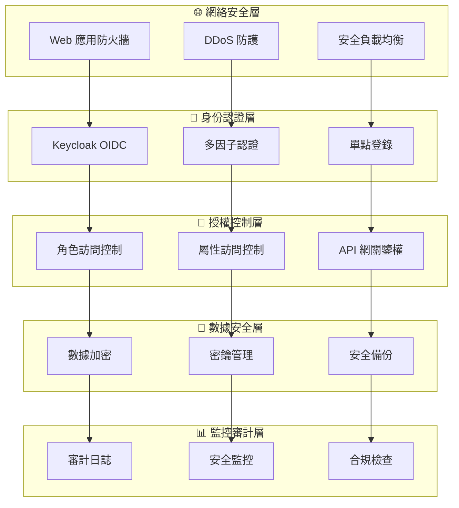
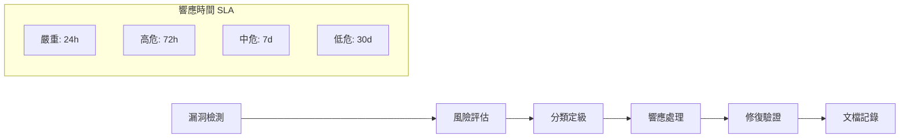

# SRE 平台安全配置指南

## 📋 文檔概覽

**文檔版本**: 1.0
**更新日期**: 2024-09-18
**目標讀者**: 安全工程師、DevOps 工程師、系統管理員

## 🛡️ 安全概覽

SRE 平台採用多層安全防護策略，涵蓋網絡安全、身份認證、授權控制、數據保護、應用安全等多個維度，確保平台在企業級環境中的安全性和合規性。

### 安全框架


## 🔐 身份認證和授權

### Keycloak OIDC 配置

#### 基礎配置
```yaml
# keycloak-config.yaml
apiVersion: v1
kind: ConfigMap
metadata:
  name: keycloak-config
  namespace: sre-platform
data:
  realm: "sre-platform"
  client-id: "sre-platform-web"
  client-secret: "${KEYCLOAK_CLIENT_SECRET}"
  auth-server-url: "https://keycloak.company.com"
  ssl-required: "external"
  resource: "sre-platform-api"
  bearer-only: true

  # OIDC 配置
  oidc:
    issuer: "https://keycloak.company.com/realms/sre-platform"
    authorization-endpoint: "/protocol/openid-connect/auth"
    token-endpoint: "/protocol/openid-connect/token"
    userinfo-endpoint: "/protocol/openid-connect/userinfo"
    jwks-uri: "/protocol/openid-connect/certs"
```

#### 用戶角色定義
```yaml
# 角色層次結構
roles:
  sre-admin:
    description: "SRE 管理員 - 完整系統權限"
    permissions:
      - "events:*"
      - "resources:*"
      - "users:*"
      - "settings:*"
      - "analytics:*"

  sre-engineer:
    description: "SRE 工程師 - 操作權限"
    permissions:
      - "events:read,update"
      - "resources:read,update"
      - "analytics:read"
      - "automation:execute"

  sre-viewer:
    description: "SRE 查看者 - 只讀權限"
    permissions:
      - "events:read"
      - "resources:read"
      - "analytics:read"

  guest:
    description: "訪客用戶 - 有限權限"
    permissions:
      - "dashboard:read"
```

### JWT 令牌安全配置

#### JWT 配置參數
```go
// jwt-config.go
type JWTConfig struct {
    SigningMethod   string        `yaml:"signing_method"`   // RS256
    SigningKey      string        `yaml:"signing_key"`      // RSA 私鑰路徑
    VerifyingKey    string        `yaml:"verifying_key"`    // RSA 公鑰路徑
    TokenExpiry     time.Duration `yaml:"token_expiry"`     // 15m
    RefreshExpiry   time.Duration `yaml:"refresh_expiry"`   // 7d
    Issuer          string        `yaml:"issuer"`
    Audience        string        `yaml:"audience"`

    // 安全設置
    RequireHTTPS    bool          `yaml:"require_https"`    // true
    CookieSecure    bool          `yaml:"cookie_secure"`    // true
    CookieHTTPOnly  bool          `yaml:"cookie_httponly"`  // true
    CookieSameSite  http.SameSite `yaml:"cookie_samesite"`  // SameSiteStrict
}
```

#### JWT 中間件實現
```go
// jwt-middleware.go
func JWTMiddleware(config *JWTConfig) gin.HandlerFunc {
    return func(c *gin.Context) {
        token := extractToken(c)
        if token == "" {
            c.AbortWithStatusJSON(401, gin.H{"error": "Missing token"})
            return
        }

        claims, err := validateToken(token, config)
        if err != nil {
            c.AbortWithStatusJSON(401, gin.H{"error": "Invalid token"})
            return
        }

        // 權限檢查
        if !hasRequiredPermission(c.FullPath(), c.Request.Method, claims) {
            c.AbortWithStatusJSON(403, gin.H{"error": "Insufficient permissions"})
            return
        }

        c.Set("user", claims)
        c.Next()
    }
}
```

### 多因子認證 (MFA) 設置

#### TOTP 配置
```yaml
# mfa-config.yaml
mfa:
  enabled: true
  providers:
    totp:
      enabled: true
      issuer: "SRE Platform"
      algorithm: "SHA256"
      period: 30
      digits: 6
      window: 1

    webauthn:
      enabled: true
      rp_display_name: "SRE Platform"
      rp_id: "sre.company.com"
      rp_origin: "https://sre.company.com"

  enforcement:
    admin_required: true
    engineer_required: true
    viewer_required: false
```

## 🔒 API 安全

### API 網關安全配置

#### 限流和熔斷
```yaml
# api-gateway-security.yaml
apiVersion: v1
kind: ConfigMap
metadata:
  name: api-gateway-security
data:
  # 限流配置
  rate_limiting:
    global_limit: "1000/minute"
    per_user_limit: "100/minute"
    per_ip_limit: "200/minute"
    burst_size: 50

  # 熔斷配置
  circuit_breaker:
    failure_threshold: 10
    recovery_timeout: "30s"
    half_open_requests: 3

  # 請求驗證
  request_validation:
    max_request_size: "10MB"
    timeout: "30s"
    allowed_methods: ["GET", "POST", "PUT", "DELETE", "PATCH"]
    required_headers: ["Authorization", "Content-Type"]
```

#### API 密鑰管理
```go
// api-key-manager.go
type APIKeyManager struct {
    store       cache.Store
    crypto      crypto.Service
    validator   validator.Service
}

func (m *APIKeyManager) GenerateAPIKey(userID, description string) (*APIKey, error) {
    key := &APIKey{
        ID:          generateUUID(),
        UserID:      userID,
        Description: description,
        Key:         generateSecureKey(32),
        CreatedAt:   time.Now(),
        ExpiresAt:   time.Now().Add(365 * 24 * time.Hour),
        Active:      true,
        Permissions: getUserPermissions(userID),
    }

    // 加密存儲
    hashedKey := m.crypto.Hash(key.Key)
    key.HashedKey = hashedKey
    key.Key = "" // 清空明文密鑰

    return key, m.store.Save(key)
}
```

### HTTPS 和 TLS 配置

#### TLS 證書配置
```yaml
# tls-config.yaml
apiVersion: v1
kind: Secret
metadata:
  name: sre-platform-tls
  namespace: sre-platform
type: kubernetes.io/tls
data:
  tls.crt: LS0tLS1CRUdJTi... # Base64 編碼的證書
  tls.key: LS0tLS1CRUdJTi... # Base64 編碼的私鑰

---
apiVersion: networking.k8s.io/v1
kind: Ingress
metadata:
  name: sre-platform-ingress
  annotations:
    nginx.ingress.kubernetes.io/ssl-redirect: "true"
    nginx.ingress.kubernetes.io/force-ssl-redirect: "true"
    nginx.ingress.kubernetes.io/ssl-protocols: "TLSv1.2 TLSv1.3"
    nginx.ingress.kubernetes.io/ssl-ciphers: "ECDHE-RSA-AES128-GCM-SHA256,ECDHE-RSA-AES256-GCM-SHA384"
spec:
  tls:
  - hosts:
    - sre.company.com
    secretName: sre-platform-tls
  rules:
  - host: sre.company.com
    http:
      paths:
      - path: /
        pathType: Prefix
        backend:
          service:
            name: sre-platform-frontend
            port:
              number: 80
```

## 💾 數據安全

### 數據加密策略

#### 靜態數據加密
```yaml
# database-encryption.yaml
postgresql:
  encryption:
    enabled: true
    method: "AES-256-CBC"
    key_management: "kubernetes-secrets"
    transparent_data_encryption: true

  backup_encryption:
    enabled: true
    method: "AES-256-GCM"
    key_rotation_interval: "90d"

redis:
  encryption:
    enabled: true
    method: "AES-256-GCM"
    auth_required: true
    tls_enabled: true
    tls_version: "1.3"
```

#### 傳輸數據加密
```go
// tls-config.go
func NewTLSConfig() *tls.Config {
    return &tls.Config{
        MinVersion:         tls.VersionTLS12,
        MaxVersion:         tls.VersionTLS13,
        CipherSuites: []uint16{
            tls.TLS_ECDHE_RSA_WITH_AES_256_GCM_SHA384,
            tls.TLS_ECDHE_RSA_WITH_CHACHA20_POLY1305,
            tls.TLS_ECDHE_RSA_WITH_AES_128_GCM_SHA256,
        },
        PreferServerCipherSuites: true,
        InsecureSkipVerify:      false,
        ClientAuth:              tls.RequireAndVerifyClientCert,
    }
}
```

### 密鑰管理

#### Kubernetes Secrets 管理
```yaml
# secrets-management.yaml
apiVersion: v1
kind: Secret
metadata:
  name: sre-platform-secrets
  namespace: sre-platform
  annotations:
    secret-generator.v1.mittwald.de/autogenerate: "password"
type: Opaque
data:
  database-password: <base64-encoded>
  redis-password: <base64-encoded>
  jwt-signing-key: <base64-encoded>
  encryption-key: <base64-encoded>

---
# 使用 External Secrets Operator 同步外部密鑰
apiVersion: external-secrets.io/v1beta1
kind: SecretStore
metadata:
  name: vault-secret-store
spec:
  provider:
    vault:
      server: "https://vault.company.com"
      path: "secret"
      version: "v2"
      auth:
        kubernetes:
          mountPath: "kubernetes"
          role: "sre-platform"
```

#### 密鑰輪轉策略
```go
// key-rotation.go
type KeyRotationScheduler struct {
    vault       vault.Client
    kubernetes  k8s.Client
    schedule    cron.Cron
}

func (r *KeyRotationScheduler) ScheduleRotation() {
    // JWT 簽名密鑰 - 每30天輪轉
    r.schedule.AddFunc("0 0 */30 * *", r.rotateJWTKey)

    // 數據庫加密密鑰 - 每90天輪轉
    r.schedule.AddFunc("0 0 */90 * *", r.rotateDatabaseKey)

    // API 密鑰 - 每年輪轉
    r.schedule.AddFunc("0 0 1 1 *", r.rotateAPIKeys)
}
```

## 🛡️ 應用安全

### 輸入驗證和防護

#### 請求驗證中間件
```go
// validation-middleware.go
func ValidationMiddleware() gin.HandlerFunc {
    return func(c *gin.Context) {
        // XSS 防護
        if err := validateXSS(c.Request); err != nil {
            c.AbortWithStatusJSON(400, gin.H{"error": "XSS attack detected"})
            return
        }

        // SQL 注入防護
        if err := validateSQLInjection(c.Request); err != nil {
            c.AbortWithStatusJSON(400, gin.H{"error": "SQL injection detected"})
            return
        }

        // 請求大小限制
        c.Request.Body = http.MaxBytesReader(c.Writer, c.Request.Body, 10<<20) // 10MB

        c.Next()
    }
}

func validateXSS(req *http.Request) error {
    // 檢查常見 XSS 模式
    xssPatterns := []string{
        `<script`,
        `javascript:`,
        `on\w+\s*=`,
        `<iframe`,
        `<object`,
    }

    for _, pattern := range xssPatterns {
        if matched, _ := regexp.MatchString(pattern, req.URL.RawQuery); matched {
            return errors.New("XSS pattern detected")
        }
    }
    return nil
}
```

#### CORS 安全配置
```go
// cors-config.go
func CORSConfig() cors.Config {
    return cors.Config{
        AllowOrigins: []string{
            "https://sre.company.com",
            "https://sre-staging.company.com",
        },
        AllowMethods: []string{
            "GET", "POST", "PUT", "DELETE", "OPTIONS",
        },
        AllowHeaders: []string{
            "Origin", "Content-Length", "Content-Type",
            "Authorization", "X-Requested-With",
        },
        ExposeHeaders: []string{
            "Content-Length", "X-Total-Count",
        },
        AllowCredentials: true,
        MaxAge:          12 * time.Hour,
    }
}
```

### 容器安全

#### Docker 安全配置
```dockerfile
# 多階段構建，減小攻擊面
FROM golang:1.21-alpine AS builder

# 創建非 root 用戶
RUN adduser -D -g '' appuser

WORKDIR /app
COPY go.mod go.sum ./
RUN go mod download

COPY . .
RUN CGO_ENABLED=0 GOOS=linux go build -a -installsuffix cgo -o main .

# 最小運行時鏡像
FROM scratch

# 複製 SSL 證書
COPY --from=builder /etc/ssl/certs/ca-certificates.crt /etc/ssl/certs/

# 複製應用和用戶信息
COPY --from=builder /etc/passwd /etc/passwd
COPY --from=builder /app/main /app/main

# 使用非 root 用戶運行
USER appuser

EXPOSE 8080
ENTRYPOINT ["/app/main"]
```

#### Kubernetes 安全策略
```yaml
# pod-security-policy.yaml
apiVersion: policy/v1beta1
kind: PodSecurityPolicy
metadata:
  name: sre-platform-psp
spec:
  privileged: false
  allowPrivilegeEscalation: false
  requiredDropCapabilities:
    - ALL
  volumes:
    - 'configMap'
    - 'emptyDir'
    - 'projected'
    - 'secret'
    - 'downwardAPI'
    - 'persistentVolumeClaim'
  runAsUser:
    rule: 'MustRunAsNonRoot'
  seLinux:
    rule: 'RunAsAny'
  fsGroup:
    rule: 'RunAsAny'

---
apiVersion: apps/v1
kind: Deployment
metadata:
  name: sre-platform-backend
spec:
  template:
    spec:
      securityContext:
        runAsNonRoot: true
        runAsUser: 10001
        fsGroup: 10001
      containers:
      - name: backend
        image: sre-platform/backend:latest
        securityContext:
          allowPrivilegeEscalation: false
          readOnlyRootFilesystem: true
          capabilities:
            drop:
            - ALL
        resources:
          limits:
            memory: "1Gi"
            cpu: "500m"
          requests:
            memory: "512Mi"
            cpu: "200m"
```

## 📊 安全監控和審計

### 審計日誌配置

#### 結構化審計日誌
```go
// audit-logger.go
type AuditEvent struct {
    Timestamp   time.Time         `json:"timestamp"`
    EventType   string           `json:"event_type"`
    UserID      string           `json:"user_id"`
    UserEmail   string           `json:"user_email"`
    Action      string           `json:"action"`
    Resource    string           `json:"resource"`
    ResourceID  string           `json:"resource_id"`
    RemoteAddr  string           `json:"remote_addr"`
    UserAgent   string           `json:"user_agent"`
    Success     bool             `json:"success"`
    ErrorMsg    string           `json:"error_msg,omitempty"`
    Metadata    map[string]any   `json:"metadata,omitempty"`
}

func (a *AuditLogger) LogEvent(ctx context.Context, event *AuditEvent) {
    event.Timestamp = time.Now()

    // 敏感信息脫敏
    event = a.sanitize(event)

    // 結構化日誌輸出
    logger.WithFields(logrus.Fields{
        "audit": true,
        "event": event,
    }).Info("Audit event")

    // 異步發送到 SIEM
    go a.sendToSIEM(event)
}
```

#### 關鍵事件監控
```yaml
# security-monitoring.yaml
security_events:
  authentication:
    - failed_login_attempts
    - successful_logins
    - password_changes
    - mfa_enrollments

  authorization:
    - permission_denied
    - role_changes
    - privilege_escalation_attempts

  data_access:
    - sensitive_data_access
    - bulk_data_exports
    - unauthorized_api_calls

  system_events:
    - configuration_changes
    - user_creation_deletion
    - security_policy_changes
```

### SIEM 集成

#### ELK Stack 配置
```yaml
# filebeat-config.yaml
filebeat.inputs:
- type: log
  paths:
    - /var/log/sre-platform/audit.log
  json.keys_under_root: true
  json.add_error_key: true
  fields:
    service: sre-platform
    environment: production

output.elasticsearch:
  hosts: ["elasticsearch:9200"]
  index: "sre-platform-audit-%{+yyyy.MM.dd}"

processors:
- add_host_metadata:
    when.not.contains.tags: forwarded
```

#### 安全告警規則
```yaml
# security-alerts.yaml
alerts:
  - name: "Multiple Failed Login Attempts"
    condition: "failed_login_attempts > 5 in 5m"
    severity: "high"
    action: "block_ip"

  - name: "Privilege Escalation Detected"
    condition: "role_changes AND elevation = true"
    severity: "critical"
    action: "immediate_review"

  - name: "Unusual Data Access Pattern"
    condition: "data_access_volume > normal_baseline * 3"
    severity: "medium"
    action: "investigate"
```

## 🔧 安全合規

### 合規框架支持

#### GDPR 合規配置
```yaml
# gdpr-compliance.yaml
gdpr:
  data_retention:
    user_data: "2555d"  # 7 years
    audit_logs: "2555d"  # 7 years
    session_data: "30d"

  data_processing:
    lawful_basis: "legitimate_interest"
    consent_required: true
    right_to_erasure: true
    data_portability: true

  privacy_settings:
    anonymization: true
    pseudonymization: true
    encryption_at_rest: true
    encryption_in_transit: true
```

#### SOC 2 合規檢查
```go
// compliance-checker.go
type ComplianceChecker struct {
    standards []ComplianceStandard
}

func (c *ComplianceChecker) CheckSOC2Compliance() *ComplianceReport {
    report := &ComplianceReport{
        Standard: "SOC 2",
        Timestamp: time.Now(),
    }

    // Security (Common Criteria)
    report.AddCheck("CC6.1", "Logical and Physical Access Controls", c.checkAccessControls())
    report.AddCheck("CC6.2", "System Credentials", c.checkCredentialManagement())
    report.AddCheck("CC6.3", "Network Security", c.checkNetworkSecurity())

    // Availability
    report.AddCheck("A1.1", "System Availability", c.checkSystemAvailability())
    report.AddCheck("A1.2", "Backup and Recovery", c.checkBackupRecovery())

    return report
}
```

### 漏洞管理

#### 安全掃描配置
```yaml
# security-scanning.yaml
apiVersion: v1
kind: ConfigMap
metadata:
  name: security-scanning-config
data:
  trivy_config: |
    # 容器鏡像掃描
    scan_types:
      - vulnerability
      - secret
      - config
    severity:
      - HIGH
      - CRITICAL
    ignore_unfixed: false

  sonarqube_config: |
    # 代碼質量掃描
    sonar.projectKey=sre-platform
    sonar.sources=.
    sonar.exclusions=**/*_test.go,**/vendor/**
    sonar.go.coverage.reportPaths=coverage.out
```

#### 漏洞響應流程


## 📋 安全檢查清單

### 部署前安全檢查

#### 基礎設施安全
- [ ] TLS 1.2+ 配置正確
- [ ] 防火牆規則最小權限原則
- [ ] 網絡分段配置
- [ ] DDoS 防護啟用
- [ ] WAF 規則配置

#### 應用安全
- [ ] 身份認證配置正確
- [ ] 授權控制實施
- [ ] 輸入驗證完整
- [ ] 錯誤處理安全
- [ ] 日誌記錄充分

#### 數據安全
- [ ] 靜態數據加密
- [ ] 傳輸數據加密
- [ ] 密鑰管理規範
- [ ] 備份加密配置
- [ ] 數據保留策略

### 運維安全監控

#### 持續監控項目
```yaml
# monitoring-checklist.yaml
monitoring:
  authentication:
    - login_success_rate
    - failed_login_attempts
    - mfa_adoption_rate
    - session_duration

  authorization:
    - permission_violations
    - role_assignment_changes
    - api_access_patterns
    - privilege_usage

  network:
    - connection_attempts
    - traffic_anomalies
    - port_scan_attempts
    - geographic_access_patterns

  system:
    - resource_utilization
    - error_rates
    - response_times
    - availability_metrics
```

## 📋 總結

SRE 平台安全配置指南提供了全面的安全防護策略，覆蓋了從基礎設施到應用層的各個安全層面。通過實施這些安全措施，可以確保平台在企業環境中的安全性、可靠性和合規性。

### 關鍵安全措施
1. **多層安全防護**: 網絡、應用、數據多層防護
2. **零信任架構**: 永不信任、始終驗證
3. **持續安全監控**: 實時威脅檢測和響應
4. **合規性支持**: 滿足 GDPR、SOC 2 等合規要求
5. **自動化安全**: DevSecOps 集成，安全左移

### 持續改進建議
- **定期安全評估**: 每季度進行安全風險評估
- **漏洞掃描自動化**: 持續集成安全掃描
- **安全培訓**: 定期安全意識培訓
- **事件響應演練**: 定期安全事件響應演練
- **安全指標監控**: 建立安全 KPI 監控體系