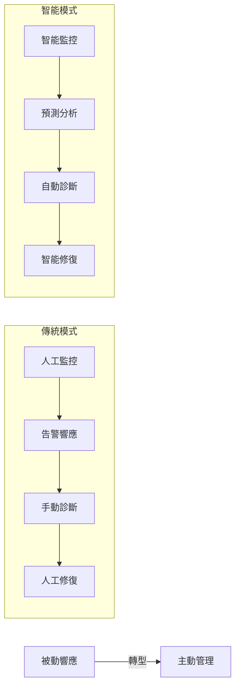
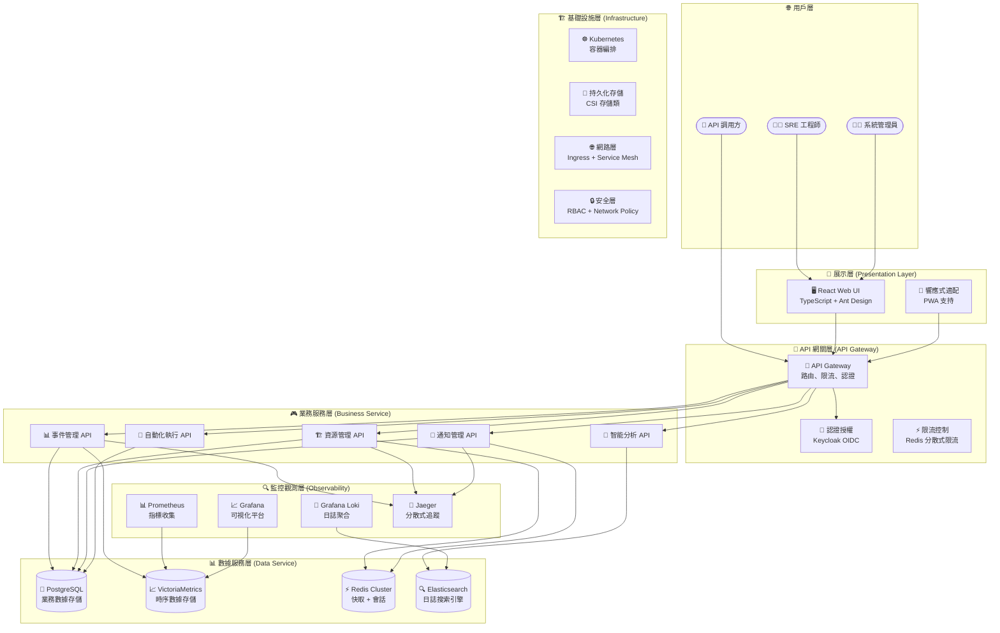
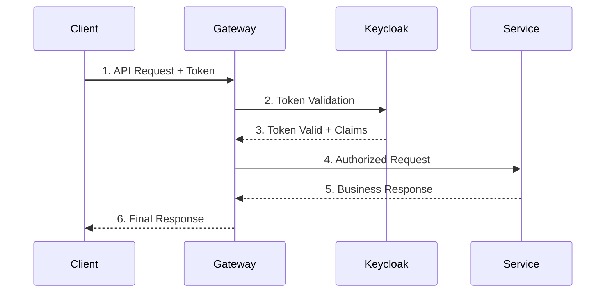
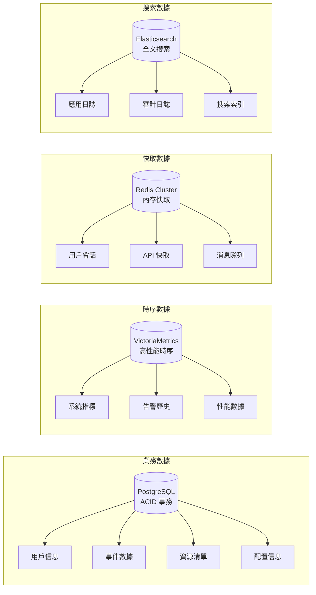

# SRE 平台系統架構設計書

## 📋 文檔概覽

**文檔版本**: 2.0
**更新日期**: 2024-09-18
**目標讀者**: 技術架構師、開發團隊、系統運維人員

## 🎯 系統概覽與核心架構哲學

SRE 平台是一個現代化的企業級維運平台，採用前後端分離架構，專為 SRE 團隊設計。平台作為「統一管理平面」(Unified Management Plane)，整合多個開源工具，實現從被動故障響應到主動系統管理的轉型。

### 統一管理層 + 開源執行引擎架構
- **平台定位**：作為「統一管理平面」(Unified Management Plane)
- **整合方式**：通過API調用Grafana Alerting和Grafana OnCall
- **核心價值**：提供最佳人員體驗，而非重建底層引擎
- **理論依據**：參考 [Google SRE Book](https://sre.google/sre-book/) 的自動化演進理念：
  - [Chapter 7: The Evolution of Automation at Google](google-sre-book/Chapter-07-The-Evolution-of-Automation-at-Google.md) - 自動化成熟度模型
  - [Chapter 5: Eliminating Toil](google-sre-book/Chapter-05-Eliminating-Toil.md) - 瑣務量化與消除

### 核心設計理念



### 智慧告警處理中樞
- **Webhook作為AI整合點**：所有告警先經過平台再分發
- **AI Agent四大核心角色**：
  1. 智慧關聯與根因分析
  2. 動態產生處理預案
  3. 自動化修復
  4. 告警風暴總結

### 關鍵技術決策

1. **統一管理層策略**: 告警管理委託給 Grafana，人員狀態管理委託給 Keycloak
2. **混合架構模式**: Go 後端處理高併發業務邏輯，React 前端提供現代化用戶體驗
3. **雲原生設計**: 完全容器化，支持 Kubernetes 部署
4. **可觀測性優先**: 內建分散式追蹤、指標收集、結構化日誌

## 📊 資訊架構原則

### 操作視圖 vs 管理配置雙軌制
| 分類 | 職責 | 使用頻率 | 範例功能 |
|------|------|----------|----------|
| **操作視圖** | 日常監控巡檢 | 高頻使用 | 儀表板、資源、事件 |
| **管理配置** | 平台設定調整 | 低頻使用 | 管理選單各項功能 |

## 🔧 核心設計邏輯

### 權責分離原則體系
1. **權限群組**：專注RBAC權限管理
2. **通知團隊**：專注通知設定與聯絡點
3. **資源群組**：擁有唯一負責團隊，確保責任歸屬

### 引導式配置策略
- 從範圍開始 → 系統自動建議 → 提供透明反饋 → 保留手動覆寫
- 降低人員操作門檿，提升配置準確性

## 🔐 身份認證整合

### Keycloak整合方案核心
- **委託專業IAM**：將帳號狀態管理交給Keycloak
- **平台專注點**：內部角色與權限映射
- **簡化管理頁面**：專注於權限群組分配

## ⚡ 自動化引擎設計

### 四大觸發機制
1. **事件驅動**：自動化修復 (設定於告警規則)
2. **排程觸發**：例行任務 (排程管理頁面)
3. **手動觸發**：日常操作 (腳本庫執行按鈕)
4. **Webhook觸發**：系統整合 (腳本詳情頁)

> 💡 **設計依據**: 參考 [Google SRE Book](google-sre-book/Chapter-07-The-Evolution-of-Automation-at-Google.md) 的自動化觸發機制設計理念

## 📈 監控策略體系

### DataOps實踐框架三支柱
1. **數據來源與資產目錄**：建立數據資產註冊表
2. **數據可觀測性**：監控數據管道健康狀態
3. **數據血緣分析**：追溯AI決策完整鏈路

### 飽和度監控指標體系
- **CPU**：平均負載 vs 核心數比率
- **記憶體**：交換空間使用情況
- **磁碟I/O**：等待時間佔比
- **網路**：頻寬使用率與封包丟失
- **應用層**：資源池使用率(連線池、線程池)

## 📋 產品規劃與分階段實施藍圖

### 關於「平台網站地圖」

**結論：最新版的網站地圖非常出色，是一個可以正式定稿的最終版本。**

它不僅結構清晰、邏輯嚴謹，更重要的是，它成功地將我們之前所有討論的優化點都融合了進來，特別是：

- **「設定」模塊的內部重組**：將「審計日誌」併入了「權限管理」，並精簡了「平台維運」，這個調整非常專業。
- **「儀表板」的獨立**：將「儀表板」作為獨立的一級導航，為其未來的擴展（如自定義儀表板）鋪平了道路。

這份資訊架構已經非常成熟，足以作為我們後續開發的指導藍圖。

### 關於「新頁面規劃」與「功能分階段」

**核心理念：聚焦「最小可行性產品 (MVP)」**

我們的第一階段目標，不是要打造一個無所不包的巨無霸系統，而是要**快速交付一個能解決 SRE 核心痛點的最小可行性產品 (MVP)**。這個 MVP 應該能讓 SRE 團隊**獨立完成從「發現問題」到「定位問題」的核心工作閉環**。

#### 為何「儀表板」功能是第一階段的核心？

**「儀表板」是整個 SRE 平台的「眼睛」和「靈魂」。**

- 如果沒有「儀表板」，SRE 將失去對系統全局狀態的**宏觀感知能力**。他們只能被動地在「事件列表」和「資源列表」中大海撈針，無法主動發現趨勢和潛在風險。
- 一個沒有儀表板的監控平台，就像一輛只有引擎和零件、卻沒有儀表盤的汽車——雖然能跑，但駕駛者完全是盲人摸象。
- 因此，`儀表板 -> 事件與資源洞察` 這個核心頁面，**必須**作為第一階段的基石來實現。

## 🎯 分階段實施策略

### 第一階段 (Phase 1)：打造 SRE 的「作戰指揮中心」
- **目標**：交付一個功能完整、能滿足 SRE 日常監控與初步診斷需求的核心平台。
- **核心模塊**：
  - ✅ **首頁 (戰情室)**：最高層級的宏觀概覽。
  - ✅ **事件管理中心**：告警的查看、規則管理與靜音。
  - ✅ **資源管理**：資源的儀表板式總覽與列表式管理。
  - ✅ **儀表板**：至少包含一個預設的、功能強大的**「事件與資源洞察」**儀表板。
  - ✅ **自動化中心 (基礎版)**：提供腳本庫、排程和日誌查看功能。
  - ✅ **設定 (核心功能)**：提供平台運行所必需的核心設定，如`權限管理`、`通知管理`和`標籤管理`。

### 第二階段 (Phase 2)：擴展賦能，服務更廣泛的角色
- **目標**：在核心平台穩定的基礎上，增加進階分析、自訂義和面向管理層的功能。
- **核心模塊**：
  - 🚀 **管理儀表板 (Executive Dashboard)**：
    - **定位**：這是一個面向**管理層或主管**的儀表板，專注於呈現與業務和成本相關的更高層級指標，例如 `SLA 達成率`、`錯誤預算消耗`、`雲資源成本趨勢`等。這是一個典型的第二階段功能。
  - 🚀 **自訂報告/儀表板 (Custom Reports/Dashboards)**：
    - **定位**：這是平台的**進階功能**，允許使用者根據自己的需求，從所有可用指標中，拖曳組合出專屬的報告或儀表板。這通常需要一個更複雜的後端和前端架構，理應在核心功能穩定後再進行開發。
  - 🚀 **進階整合**：
    - `創建工單`、`查看 Runbook` 等與外部系統的深度整合。

### 實施策略總結

這個分階段的路線圖，能幫助您：
1. **降低初期風險**：確保第一階段交付的核心產品，能夠快速為 SRE 團隊帶來價值。
2. **驗證核心需求**：在 MVP 上線後，根據真實的使用者回饋，來決定第二階段功能的優先級。
3. **合理分配資源**：將最複雜、最具挑戰性的功能（如自定義儀表板）放在第二階段，確保開發團隊有充足的時間進行設計和研發。

**關鍵決策**：請堅定地將**核心的「儀表板」功能保留在第一階段**，並將「管理儀表板」和「自訂報告」作為您在第二階段擴展平台影響力的王牌。

## 🏗️ 整體架構

### 系統分層架構



### 核心組件說明

#### 🎯 前端平台 (React + TypeScript)
- **技術棧**: React 18 + TypeScript 5 + Ant Design 5 + Vite
- **主要職責**:
  - 統一的管理界面和用戶體驗
  - 資源生命週期可視化管理
  - 任務編排和調度界面
  - 實時監控數據展示
  - 響應式設計支持多設備

#### 🔧 後端服務 (Go)
- **技術棧**: Go 1.21+ + Gin + GORM + Redis + PostgreSQL
- **主要職責**:
  - RESTful API 服務提供
  - 複雜業務邏輯處理
  - 數據持久化管理
  - 外部系統集成
  - AI Agent 驅動的智能分析
  - 自動化工作流執行

## 📐 詳細架構設計

### 1. API 設計架構

#### RESTful API 設計原則
```yaml
# 基於 OpenAPI 3.1.0 規範
基礎路徑: /api/v1
認證方式: Bearer Token (OIDC)
內容類型: application/json
響應格式: 統一的 ResponseWrapper<T>

# 核心 API 模組
/auth/*          # 認證授權
/events/*        # 事件管理
/resources/*     # 資源管理
/notifications/* # 通知管理
/analytics/*     # 分析報告
/automation/*    # 自動化執行
```

#### API 安全設計


### 2. 數據架構設計

#### 數據存儲策略


#### 數據模型設計要點
1. **用戶系統**: 委託 Keycloak 管理，本地僅存儲業務關聯數據
2. **事件模型**: 支持層級關聯、狀態流轉、AI 分析結果存儲
3. **資源模型**: 多維度標籤、動態屬性、批量操作支持
4. **通知模型**: 多渠道、模板化、條件觸發機制

## 🛠️ 技術實作細節

### 監控採集策略矩陣
| 資源類型 | 可安裝Agent | 推薦方案 | 理由 |
|----------|-------------|----------|------|
| Linux/Windows伺服器 | ✅ 是 | node_exporter | 黃金標準，指標最全面 |
| 網路設備 | ❌ 否 | snmp_exporter | 業界標準，專為網路設備設計 |
| 應用程式 | ✅ 是 | 專屬Exporter | 獲取應用內部性能指標 |
| 自訂應用 | ✅ 是 | Prometheus Client Library | 從源頭暴露指標 |

### 資源分類管理體系
| 資源類型 | 標籤 | 說明 |
|----------|------|------|
| Host | 基礎設施資源 | 物理/虛擬主機 |
| Service | 應用服務資源 | 微服務單元 |
| Database | 資料庫資源 | 託管資料庫實例 |
| Container | 容器資源 | Kubernetes容器實例 |
| Cloud Resource | 雲端資源 | AWS/GCP雲服務 |

## 🧰 技術棧

根據藍圖設計文件，SRE平台涉及以下技術棧：

### 前端技術
- **React 18**：用於構建互動原型
- **TypeScript**：提供類型安全
- **Ant Design 5**：UI組件庫
- **ECharts 5**：數據可視化工具

### 前端觀測性
- **Sentry**：前端錯誤追蹤和性能監控
- **OpenTelemetry JavaScript**：前端人員行為追蹤
- **Web Vitals**：核心 Web 性能指標監控
- **Real User Monitoring (RUM)**：真實人員監控

### 後端與監控技術
- **Go 1.21+**：高性能後端語言
- **Gin**：HTTP Web 框架
- **GORM**：ORM 數據庫操作
- **Zap**：高性能結構化日誌記錄
- **OpenTelemetry**：分散式追蹤、指標和日誌收集
- **Grafana Alloy**：統一觀測性數據收集器
- **Grafana Alerting**：告警規則與路由引擎
- **VictoriaMetrics**：時序數據庫存儲
- **Prometheus node_exporter**：系統指標收集
- **snmp_exporter**：網路設備指標收集

### 觀測性架構 (Observability)
- **OpenTelemetry 統一匯出**：Logs/Traces/Metrics 三合一觀測性數據
- **Grafana Alloy 作為收集器**：統一接收和轉發觀測性數據
- **多目標匯出**：支援本地 Grafana 或 Grafana Cloud
- **結構化日誌**：使用 Zap (後端) 提供高性能結構化日誌記錄
- **分散式追蹤**：端到端請求追蹤和性能監控
- **業務指標**：自定義業務指標收集和分析
- **前端監控**：Sentry + Web Vitals + RUM 真實人員監控
- **性能測試**：K6 負載測試和性能監控

### 數據流架構
```
前端 (React) → OpenTelemetry JS → Grafana Alloy → Grafana/Loki
    ↓
後端 (Go) → OpenTelemetry Go → Grafana Alloy → VictoriaMetrics
    ↓
測試 (K6) → 性能指標 → Grafana Alloy → Grafana Dashboards
```

### 身份認證
- **Keycloak**：專業IAM系統，處理人員身份與權限

## ⚖️ 重要技術決策

### 1. 架構決策：統一管理層 + 開源執行引擎
**決策內容**：
- 平台作為「統一管理層」，專注於人員體驗
- 底層依賴Grafana等開源工具作為「執行引擎」
- 通過API調用整合Grafana功能

** rationale**：
- 避免重複造輪子
- 利用成熟開源工具的能力
- 專注於提供增值的人員體驗

### 2. 數據收集策略決策
**決策內容**：
- 優先使用`node_exporter`進行深度監控（侵入式）
- 無法安裝agent時使用`snmp_exporter`（非侵入式）

** rationale**：
- `node_exporter`提供更豐富的系統指標
- `snmp_exporter`適用於網路設備等無法安裝agent的場景
- 平衡監控深度與部署複雜度

### 3. 身份認證決策
**決策內容**：
- 整合Keycloak進行身份認證
- 平台不再自行管理帳號狀態

** rationale**：
- 專業事項委託專業系統處理
- 簡化平台複雜度
- 提高安全性

### 4. AI整合決策
**決策內容**：
- 所有告警先經平台Webhook服務再分發
- AI Agent在Webhook服務中進行分析處理

** rationale**：
- 實現AI分析的統一入口
- 提供上下文豐富的分析能力
- 支持自動化修復等功能

### 5. 功能分階段實施決策
**決策內容**：
- Phase 1：聚焦監控與洞察核心功能
- Phase 2：實現響應與協作整合功能

** rationale**：
- 確保核心監控能力穩定
- 降低外部系統依賴風險
- 通過人員反饋優化後續功能

### 6. 資源分類決策
**決策內容**：
- 將資源分為多個類型：Host、Service、Database、Container、Cloud Resource
- 在資源列表中明確標示資源類型

** rationale**：
- 統一管理不同層次的資源
- 提供清晰的資源視圖
- 支持針對性的監控策略

### 7. 飽和度監控決策
**決策內容**：
- 監控資源飽和度而非僅使用率
- 針對不同資源類型定義專門的飽和度指標

** rationale**：
- 更準確反映系統壓力狀況
- 提供預警性監控能力
- 支持更精細的容量規劃

### 8. **告警管理完全委託給 Grafana**
**決策內容**：
- 本平台不再自行實作告警規則的判斷邏輯
- 透過一組新的 API 來管理 Grafana 的告警規則與接觸點
- 其資料結構會參考 Grafana 的官方 API

** rationale**：
- 專注於人員體驗而非重複造輪子
- 利用 Grafana 成熟的告警引擎
- 簡化平台複雜度，提升可靠性

### 9. **人員狀態管理完全委託給 Keycloak**
**決策內容**：
- 由於整合了 SSO，從本平台的「人員管理」功能中移除所有關於人員「狀態」的欄位與相關邏輯
- 平台專注於內部權限映射

** rationale**：
- 專業IAM系統處理人員生命週期管理
- 簡化平台人員管理介面
- 提高安全性與一致性

### 10. **內部人員狀態管理 (Internal User Status)**
**決策內容**：
- 在 `users` 表中保留一個 `is_active` 欄位
- 此欄位用於控制平台內部的業務邏輯，如任務指派、通知等

** rationale**：
- 避免因 SSO 系統中的人員狀態變更，導致平台內部數據關聯中斷
- 提供平台管理員一個獨立的人員啟用/停用控制開關
- 實現平台內部業務邏輯與外部認證系統的解耦

### 11. **軟刪除策略 (Soft Delete Strategy)**
**決策內容**：
- 核心資源表（如 `users`, `teams`, `resources`）採用軟刪除機制
- 透過 `deleted_at` 時間戳欄位來標記刪除狀態

** rationale**：
- **數據完整性**: 確保與已刪除資源相關的歷史記錄（如審計日誌、事件記錄）不會因級聯刪除而丟失，這對於一個需要嚴格審計的 SRE 平台至關重要。
- **可恢復性**: 提供一個快速恢復被誤刪除數據的機制，增加系統的容錯能力。
- **歷史追溯**: 即使資源被刪除，其歷史操作和關聯依然可以被追溯，滿足合規性與故障分析的需求。

---

## 📋 架構總結

您的 SRE 平台的核心價值，在於提供了一個**統一、易用的管理介面 (Unified Management Plane)**，將 Grafana Alerting、Grafana OnCall 這些強大但可能分散的工具整合在一起。

您應該專注於打造最好的上層體驗，而不是重建底層已經非常成熟的引擎。

**最終的推薦架構如下：**

1. **您的平台 (UI + Backend)**：作為**「總控制器」**。
2. **呼叫 API**：您的後端透過 API 去設定和管理 Grafana 的：
   * 告警規則 (Alert Rules)
   * 通知策略 (Notification Policies) & 接觸點 (Contact Points)
   * On-Call 排程 (On-Call Schedules)
3. **Grafana**：作為**「核心執行引擎」**，負責實際的告警判斷、路由和 On-Call 查詢。

這個架構可以讓您在享受 Grafana 強大能力的同時，又能提供給使用者一個完全客製化、無縫整合的平台體驗。
