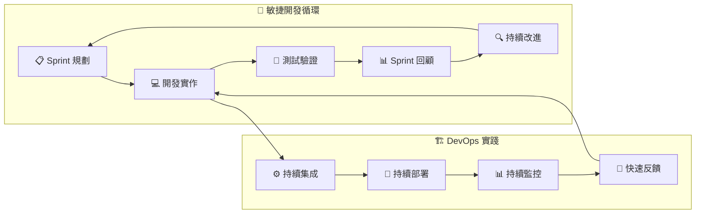
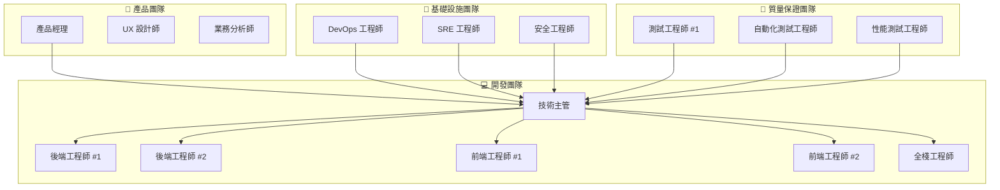
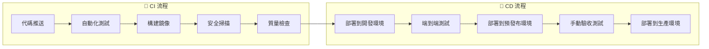
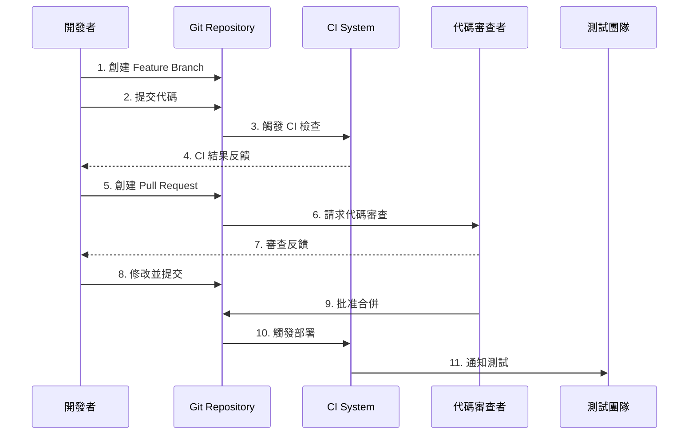
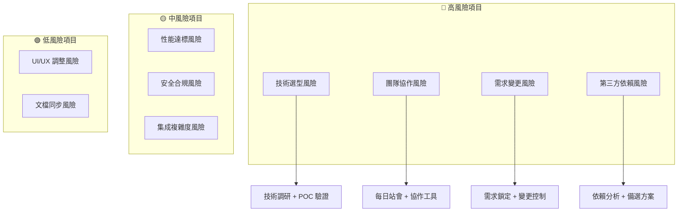
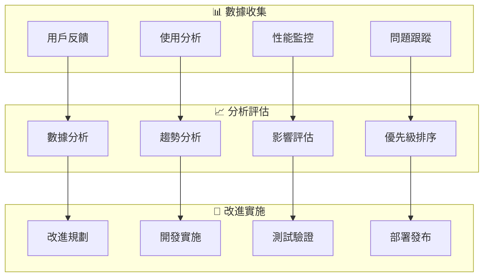

# SRE 平台開發總規劃

## 📋 文檔概覽

**文檔版本**: 2.0
**更新日期**: 2025-09-18
**目標讀者**: 專案經理、開發團隊、技術主管

## 🎯 專案總覽

SRE 平台是一個現代化的企業級維運平台開發專案，採用敏捷開發方法論，分階段實施策略，確保高質量交付和持續價值實現。

### 專案目標
- **主要目標**: 構建新一代 SRE 智能維運平台
- **核心價值**: 從被動故障響應轉向主動系統管理
- **技術願景**: 雲原生、AI 驅動、高度自動化
- **商業價值**: 降低 MTTR、提升系統可靠性、減少人工介入

### 目前狀態與下一步 (Current Status & Next Steps)
- **目前狀態**: **Phase 1 (基礎平台建設)** 的**設計階段**已經全面完成。
- **核心產出**:
  - `pages.md`: 已完成所有 UI 頁面的深度分析，確立了後端架構和 API 設計方向。
  - `openapi.yaml`: 已根據 `pages.md` 的分析，完成 API 契約的定義。
  - `db_schema.sql`: 已根據 `pages.md` 的分析，完成資料庫綱要的設計。
- **下一步**: 進入後端服務的實作階段，根據 `openapi.yaml` 和 `db_schema.sql` 開發業務邏輯。

## 📈 開發方法論

### 敏捷開發框架



### 開發原則
1. **迭代增量**: 2 週 Sprint，快速交付價值
2. **測試驅動**: TDD/BDD，確保代碼質量
3. **持續集成**: 自動化 CI/CD，降低集成風險
4. **用戶中心**: 以 SRE 工程師需求為核心
5. **文檔同步**: 文檔即代碼，保持同步更新

## 🎯 分階段實施策略

### Phase 1: 基礎平台建設 (MVP) - (設計已完成)
**時間週期**: 8-10 週
**目標**: 建立核心功能基礎，實現基本的 SRE 工作流程
**狀態**: 設計階段已完成，核心產出為 `pages.md`, `openapi.yaml`, `db_schema.sql`。開發任務將基於這些已定稿的契約文件進行。

#### 🏗️ Sprint 1-2: 基礎架構搭建 (4 週) - (已完成)

**Sprint 1 (週 1-2): 後端核心框架**
```mermaid
gantt
    title Sprint 1: 後端核心框架
    dateFormat  X
    axisFormat %w

    section 基礎設施
    項目初始化           :a1, 0, 2d
    Docker 環境        :a2, after a1, 2d
    CI/CD 管道        :a3, after a2, 2d

    section 後端開發
    Go 框架搭建        :b1, 0, 3d
    數據庫設計        :b2, after b1, 2d
    API 基礎架構      :b3, after b2, 3d

    section 認證系統
    Keycloak 集成     :c1, 4d, 4d
    JWT 驗證         :c2, after c1, 2d
```

**交付目標**:
- ✅ 完整的開發環境設置
- ✅ Go 後端基礎框架
- ✅ PostgreSQL 數據庫設計
- ✅ Keycloak 認證集成
- ✅ CI/CD 管道建立

**Sprint 2 (週 3-4): 前端基礎框架**
```mermaid
gantt
    title Sprint 2: 前端基礎框架
    dateFormat  X
    axisFormat %w

    section 前端設置
    React 項目初始化    :a1, 0, 2d
    TypeScript 配置   :a2, after a1, 1d
    Ant Design 集成   :a3, after a2, 2d

    section 基礎組件
    佈局組件           :b1, 2d, 3d
    導航組件           :b2, after b1, 2d
    認證組件           :b3, after b2, 3d

    section 狀態管理
    Redux Toolkit     :c1, 5d, 3d
    API 客戶端        :c2, after c1, 2d
```

**交付目標**:
- ✅ React + TypeScript 項目架構
- ✅ Ant Design 組件庫集成
- ✅ 基礎佈局和導航系統
- ✅ Redux 狀態管理
- ✅ API 客戶端封裝

#### 🔧 Sprint 3-4: 核心功能模組 (4 週)

**Sprint 3 (週 5-6): 事件管理系統**

**開發任務分解**:
```yaml
後端任務:
  - 事件數據模型設計 (2d)
  - 事件 CRUD API 實現 (3d)
  - 事件狀態流轉邏輯 (2d)
  - 事件關聯功能 (2d)
  - 單元測試編寫 (1d)

前端任務:
  - 事件列表頁面 (3d)
  - 事件詳情頁面 (3d)
  - 事件篩選功能 (2d)
  - 事件操作功能 (2d)
  - 組件測試 (1d)

集成任務:
  - API 集成測試 (1d)
  - 端到端測試 (2d)
```

**Sprint 4 (週 7-8): 資源管理系統**

**開發任務分解**:
```yaml
後端任務:
  - 資源數據模型設計 (2d)
  - 資源 CRUD API 實現 (3d)
  - 資源分組功能 (2d)
  - 資源監控集成 (3d)

前端任務:
  - 資源列表頁面 (3d)
  - 資源拓撲視圖 (4d)
  - 資源批量操作 (2d)
  - 資源詳情展示 (1d)

集成任務:
  - Prometheus 數據集成 (2d)
  - 實時數據更新 (2d)
```

### Phase 2: 智能化能力建設 (6-8 週)
**目標**: 集成 AI 分析能力，實現智能診斷和預測

#### 🧠 AI 能力集成

**Sprint 5-6: AI 分析引擎**
- **LLM 集成**: OpenAI/Claude API 集成
- **智能診斷**: 基於事件模式的智能分析
- **根因分析**: AI 驅動的根因分析算法
- **修復建議**: 基於歷史數據的修復建議

**Sprint 7-8: 預測分析能力**
- **容量預測**: 基於歷史數據的容量規劃
- **故障預測**: 機器學習模型預測系統故障
- **性能分析**: 性能趨勢分析和優化建議
- **成本優化**: 基於使用模式的成本優化建議

### Phase 3: 企業級功能完善 (4-6 週)
**目標**: 完善企業級功能，支持大規模生產環境

#### 🏢 企業級特性

**Sprint 9-10: 高級功能**
- **工作流引擎**: 自動化工作流設計和執行
- **通知系統**: 多渠道通知和升級機制
- **報告系統**: 自動化報告生成和分發
- **API 管理**: API 版本管理和文檔系統

**Sprint 11-12: 運維支持**
- **監控集成**: 深度 Grafana/Prometheus 集成
- **日誌系統**: 集中化日誌收集和分析
- **備份恢復**: 數據備份和災難恢復機制
- **性能優化**: 系統性能調優和擴展性改進

## 👥 團隊組織結構

### 核心團隊配置



### 角色職責定義

| 角色 | 主要職責 | 所需技能 | 工作比例 |
|------|----------|----------|----------|
| **技術主管** | 技術架構、代碼審查、團隊協調 | Go/React/架構設計 | 100% |
| **後端工程師** | API 開發、業務邏輯、數據庫設計 | Go/PostgreSQL/Redis | 100% |
| **前端工程師** | UI 開發、交互設計、用戶體驗 | React/TypeScript/Ant Design | 100% |
| **全棧工程師** | 跨棧開發、集成測試、原型開發 | Go/React/DevOps | 100% |
| **DevOps 工程師** | CI/CD、基礎設施、監控 | K8s/Docker/Prometheus | 80% |
| **測試工程師** | 功能測試、自動化測試、質量保證 | 測試框架/自動化工具 | 100% |

## 🛠️ 技術實施計劃

### 開發環境標準化

#### 本地開發環境
```yaml
必需工具:
  - Go 1.21+
  - Node.js 18+
  - Docker Desktop
  - PostgreSQL 15+
  - Redis 7+

IDE 配置:
  - VS Code 統一配置
  - Go 擴展包
  - TypeScript 擴展包
  - Docker 擴展包

代碼規範:
  - Go: gofmt + golint
  - TypeScript: ESLint + Prettier
  - Git Hooks: pre-commit 檢查
```

#### CI/CD 管道設計


### 使用 Mock Server 進行前端開發
為了實現前後端分離並行開發，專案提供了一個功能完善的 Mock Server。前端開發者可以在後端 API 尚未完全開發完成時，透過此 Mock Server 進行完整的功能開發與測試。

- **技術**: 基於 `json-server`，並透過 `server.js` 擴充了自定義路由以模擬更真實的 API 行為 (如分頁、篩選)。
- **資料來源**: 所有的模擬資料都定義在 `mock-server/db.json` 中。此檔案的結構與 `openapi.yaml` 中定義的 schemas 保持一致。
- **API 契約**: Mock Server 提供的 API 端點嚴格遵循 `openapi.yaml` 中定義的契約。

**快速啟動**:
```bash
# 1. 進入 mock-server 目錄
cd mock-server

# 2. 安裝依賴 (僅需初次執行)
npm install

# 3. 啟動伺服器
npm start
```
伺服器將會啟動在 `http://localhost:8080`。前端開發時，請將 API 請求的基礎 URL 指向此位址。

### 代碼質量保證

#### 自動化測試策略
```yaml
單元測試:
  覆蓋率目標: > 80%
  工具: Go test + Jest
  執行頻率: 每次提交

集成測試:
  覆蓋率目標: 主要 API 路徑
  工具: Go test + Supertest
  執行頻率: 每日構建

端到端測試:
  覆蓋率目標: 核心用戶流程
  工具: Playwright + Cypress
  執行頻率: 部署前執行

性能測試:
  目標: API P95 < 200ms
  工具: k6 + Artillery
  執行頻率: 週期性執行
```

#### 代碼審查流程


## 📊 項目監控和控制

### 關鍵績效指標 (KPIs)

#### 開發效率指標
| 指標 | 目標值 | 測量方法 | 報告頻率 |
|------|--------|----------|----------|
| **Sprint 完成率** | > 85% | 故事點完成情況 | Sprint 結束 |
| **程式碼提交頻率** | 每天 > 3 次 | Git 提交統計 | 每週 |
| **缺陷密度** | < 0.5 個/KLOC | 缺陷數/代碼行數 | 每月 |
| **構建成功率** | > 95% | CI/CD 統計 | 每日 |
| **部署頻率** | 每週 > 2 次 | 部署記錄 | 每週 |

#### 質量保證指標
| 指標 | 目標值 | 測量方法 | 報告頻率 |
|------|--------|----------|----------|
| **單元測試覆蓋率** | > 80% | 覆蓋率工具 | 每次構建 |
| **集成測試通過率** | > 95% | 測試結果 | 每日 |
| **代碼審查覆蓋率** | 100% | PR 統計 | 每週 |
| **安全掃描通過率** | 100% | 安全工具 | 每次構建 |
| **性能測試通過率** | > 90% | 性能測試結果 | 每週 |

### 風險管理

#### 主要風險識別


#### 風險緩解策略
| 風險 | 影響等級 | 緩解策略 | 責任人 | 監控指標 |
|------|----------|----------|---------|-----------|
| **技術選型風險** | 高 | POC 驗證 + 專家評審 | 技術主管 | POC 完成度 |
| **團隊協作風險** | 高 | 敏捷實踐 + 溝通機制 | 專案經理 | 團隊滿意度 |
| **需求變更風險** | 中 | 需求鎖定 + 變更流程 | 產品經理 | 變更次數 |
| **性能風險** | 中 | 性能測試 + 持續監控 | 性能工程師 | 性能指標 |

## 📅 詳細時程規劃

### 整體項目時間線

```mermaid
gantt
    title SRE 平台開發總時程
    dateFormat  YYYY-MM-DD
    axisFormat  %m-%d

    section Phase 1: 基礎建設 (設計已完成)
    Sprint 1: 後端框架 (已完成)     :done, s1, 2024-09-18, 14d
    Sprint 2: 前端框架 (已完成)     :done, s2, after s1, 14d
    Sprint 3: 事件管理 (設計已完成)   :done, s3, after s2, 14d
    Sprint 4: 資源管理 (設計已完成)   :done, s4, after s3, 14d

    section Phase 2: 智能化 (下一步)
    Sprint 5: AI 分析引擎  :s5, after s4, 14d
    Sprint 6: AI 診斷能力  :s6, after s5, 14d
    Sprint 7: 預測分析     :s7, after s6, 14d
    Sprint 8: 智能優化     :s8, after s7, 14d

    section Phase 3: 企業級
    Sprint 9: 工作流引擎   :s9, after s8, 14d
    Sprint 10: 通知系統    :s10, after s9, 14d
    Sprint 11: 運維支持    :s11, after s10, 14d
    Sprint 12: 性能優化    :s12, after s11, 14d
```

### 里程碑和交付物

#### Phase 1 里程碑
**M1 - MVP 完成 (第 8 週)**
- ✅ 基礎認證和授權系統
- ✅ 事件管理完整功能
- ✅ 資源管理基礎功能
- ✅ 基本監控集成
- ✅ 部署到預發布環境

#### Phase 2 里程碑
**M2 - 智能化能力 (第 16 週)**
- ✅ AI 分析和診斷功能
- ✅ 智能預測和建議
- ✅ 自動化工作流程
- ✅ 性能和可用性達標

#### Phase 3 里程碑
**M3 - 生產就緒 (第 24 週)**
- ✅ 企業級功能完備
- ✅ 高可用性和可擴展性
- ✅ 安全和合規認證
- ✅ 文檔和培訓材料完整
- ✅ 生產環境部署

## 💰 資源和預算規劃

### 人力資源投入

| 角色 | 人數 | 每月成本 | 24 週總成本 |
|------|------|----------|-------------|
| **技術主管** | 1 | $12,000 | $72,000 |
| **後端工程師** | 2 | $8,000 | $96,000 |
| **前端工程師** | 2 | $8,000 | $96,000 |
| **全棧工程師** | 1 | $9,000 | $54,000 |
| **DevOps 工程師** | 1 | $10,000 | $60,000 |
| **測試工程師** | 2 | $7,000 | $84,000 |
| **產品經理** | 1 | $10,000 | $60,000 |
| **UX 設計師** | 1 | $8,000 | $48,000 |

**總人力成本**: $570,000

### 基礎設施成本

| 項目 | 月成本 | 24 週總成本 | 說明 |
|------|--------|-------------|------|
| **雲端基礎設施** | $3,000 | $18,000 | AWS/GCP 資源 |
| **第三方服務** | $1,000 | $6,000 | API 費用、監控工具 |
| **開發工具許可** | $500 | $3,000 | IDE、分析工具 |
| **CI/CD 平台** | $300 | $1,800 | GitHub Actions/Jenkins |

**總基礎設施成本**: $28,800

### 總項目預算
- **人力成本**: $570,000 (95%)
- **基礎設施成本**: $28,800 (5%)
- **總預算**: $598,800
- **預留風險緩衝**: $59,880 (10%)
- **最終預算**: $658,680

## 📋 成功標準定義

### 技術成功標準

#### 功能完整性
- ✅ 所有 MVP 功能 100% 實現
- ✅ API 覆蓋率達到 OpenAPI 規範 95%
- ✅ UI/UX 實現 pages.md 分析的 90% 需求
- ✅ 智能化功能可用性達到 80%

#### 性能指標
- ✅ API 響應時間 P95 < 200ms
- ✅ 頁面加載時間 P95 < 2s
- ✅ 系統可用性 > 99.5%
- ✅ 併發用戶支持 > 1,000

#### 質量指標
- ✅ 代碼覆蓋率 > 80%
- ✅ 安全掃描 0 高危漏洞
- ✅ 性能測試通過率 > 95%
- ✅ 用戶驗收測試通過率 > 90%

### 業務成功標準

#### 用戶滿意度
- ✅ SRE 工程師滿意度 > 4.5/5
- ✅ 系統易用性評分 > 4.0/5
- ✅ 功能完整性評分 > 4.0/5
- ✅ 用戶培訓完成率 > 90%

#### 運維效率提升
- ✅ MTTR (平均修復時間) 降低 > 30%
- ✅ 告警處理效率提升 > 40%
- ✅ 人工介入事件減少 > 50%
- ✅ 系統穩定性提升 > 20%

## 🔄 持續改進機制

### 反饋收集機制



### 版本迭代策略
- **主版本**: 每季度發布，包含重大功能更新
- **次版本**: 每月發布，包含功能改進和優化
- **修訂版本**: 每週發布，包含問題修復
- **熱修復**: 按需發布，處理緊急問題

### 長期維護計劃
- **技術債務清理**: 每季度安排 1 個 Sprint
- **依賴更新**: 每月自動化檢查和更新
- **安全補丁**: 7 天內應用關鍵安全更新
- **性能優化**: 每半年進行系統性能評估

## 📋 總結

SRE 平台開發總規劃採用分階段實施策略，通過 24 週的開發週期，逐步構建從基礎 MVP 到企業級智能維運平台的完整解決方案。

### 關鍵成功因素
1. **明確的階段目標**: 每個 Phase 都有明確的交付目標和成功標準
2. **敏捷開發實踐**: 2 週 Sprint，快速迭代和反饋
3. **質量保證機制**: 多層次測試和代碼審查
4. **風險控制策略**: 主動風險識別和緩解措施
5. **持續改進文化**: 反饋驅動的持續優化

### 預期收益
- **開發效率**: 標準化流程提升開發效率 30%
- **代碼質量**: 自動化測試和審查提升代碼質量 40%
- **交付速度**: 敏捷實踐縮短交付週期 25%
- **維護成本**: 良好架構降低維護成本 50%

這個開發總規劃為 SRE 平台項目的成功實施提供了完整的路線圖和執行框架，確保項目能夠按時、按質、按預算完成交付。