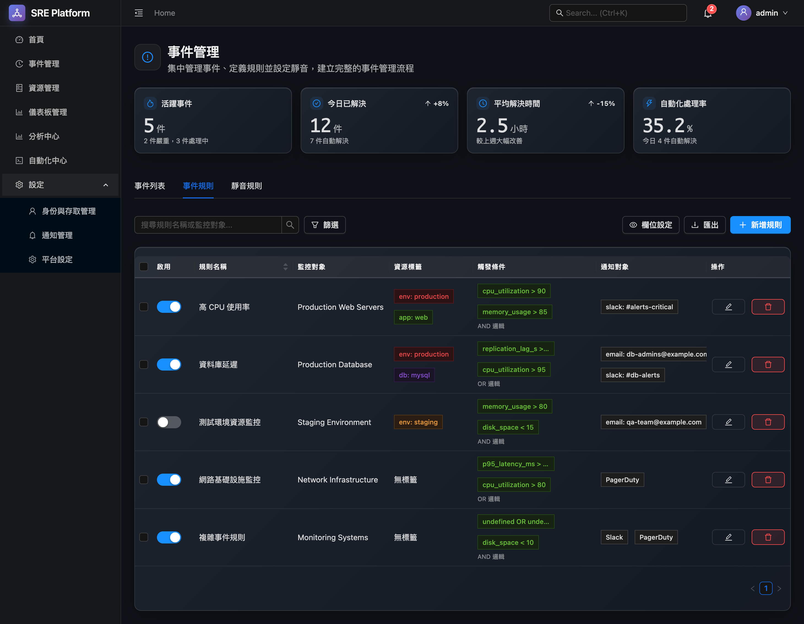
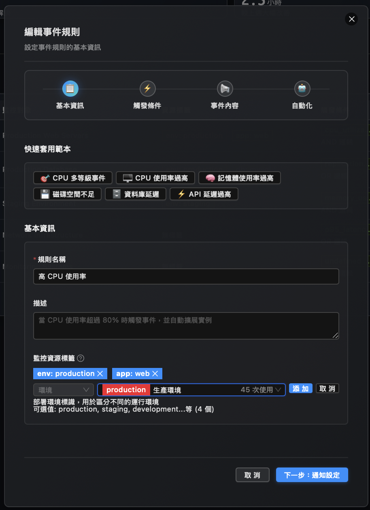
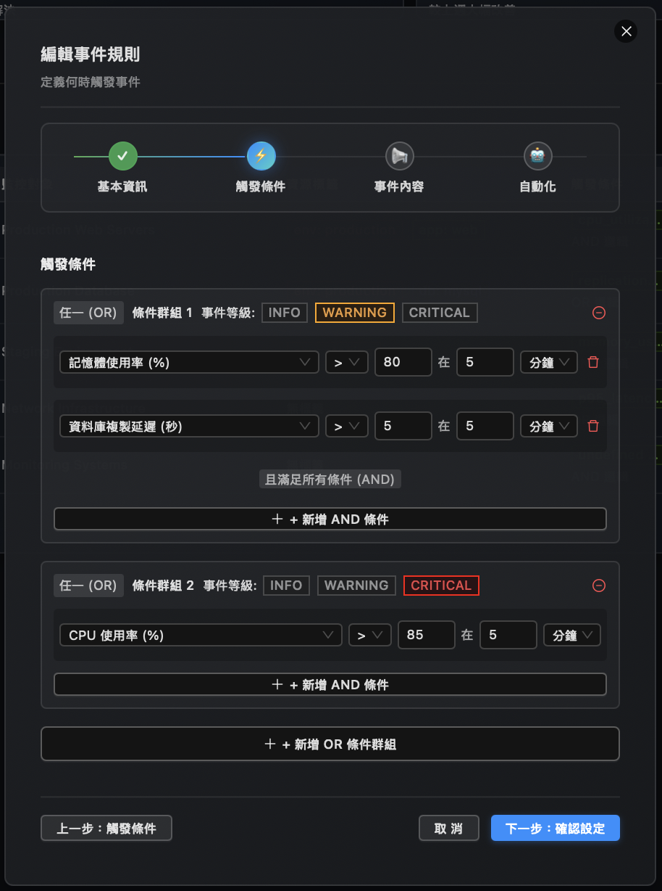
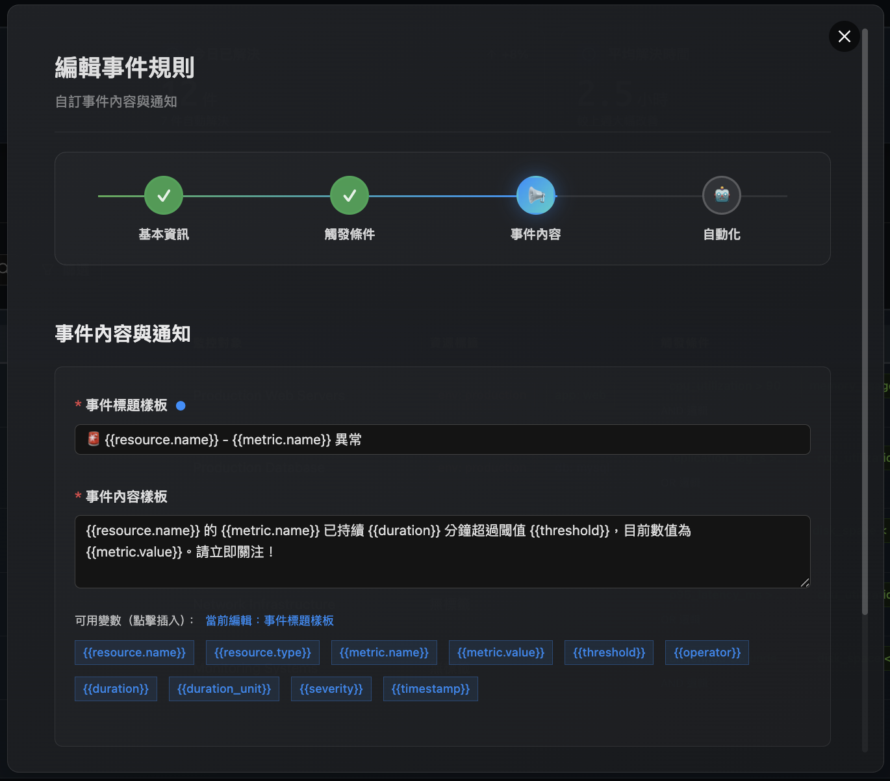
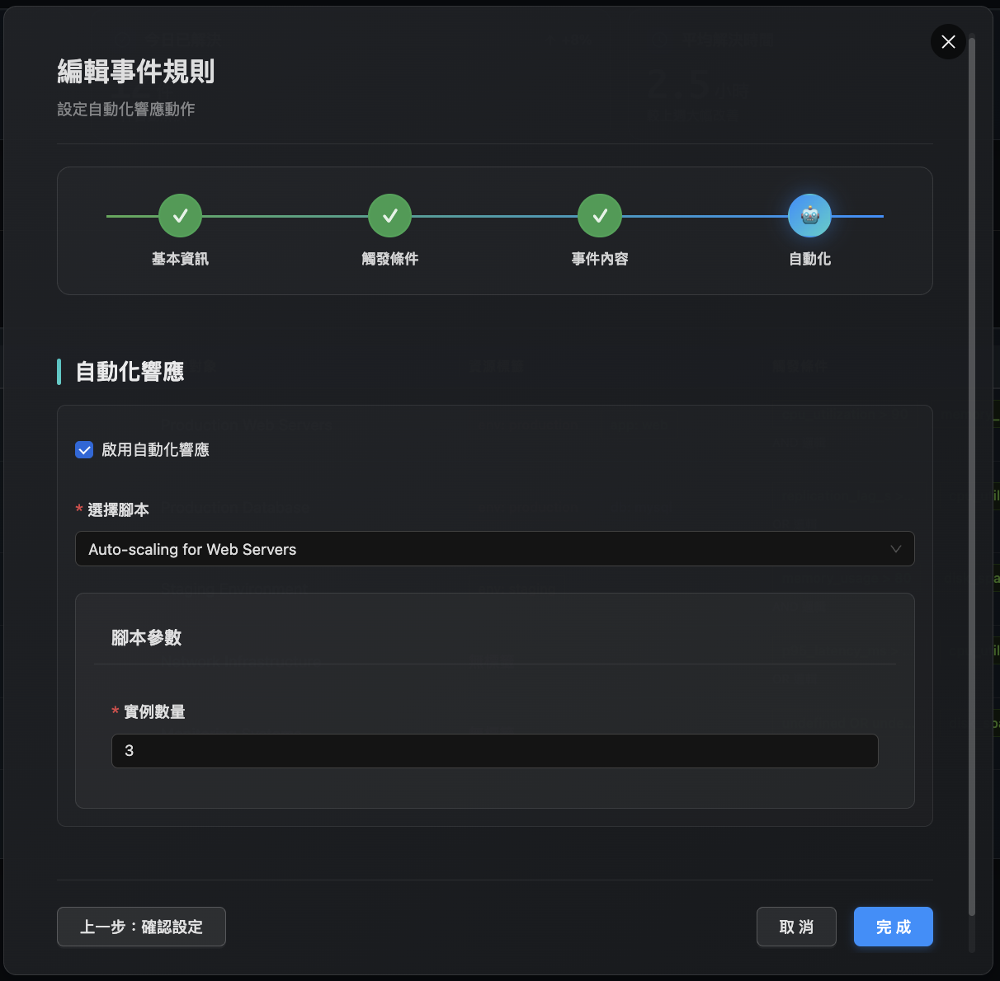
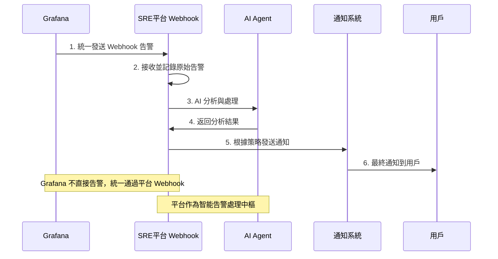
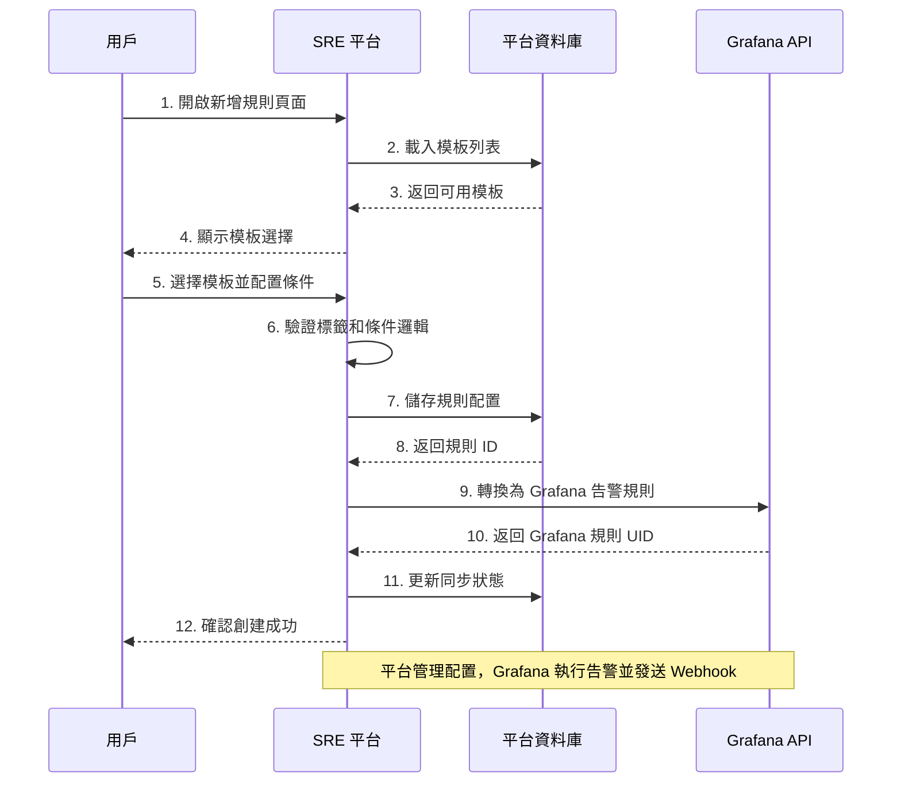
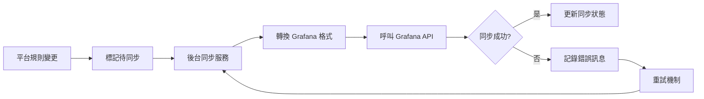

# SRE 平台事件規則管理架構分析報告

**報告版本**: 1.0
**分析日期**: 2025-09-23
**分析師**: AI Assistant
**基準文檔**: architecture.md v3.0, UI 設計圖, db_schema.sql v3.0

## 📋 執行摘要

基於事件管理 UI 設計圖的深入分析，本報告重新評估了 SRE 平台在事件規則管理方面的職責定位。分析結果顯示，平台需要實現「統一管理層 + 開源執行引擎」的架構模式，其中**平台負責規則配置管理，Grafana 負責規則執行**。

### 🎯 關鍵發現

- **✅ 事件規則管理是平台核心職責** - 提供統一的規則配置界面
- **🔄 與 Grafana 形成互補分工** - 平台管理配置，Grafana 執行告警
- **📊 需要新增資料庫表格** - 支持完整的規則配置管理功能
- **🎨 UI 設計體現統一管理價值** - 友善的多步驟配置流程

### 📈 架構修正結論

**修正前評估**: ⚠️ `events` 表可能與 Grafana 功能重疊
**修正後評估**: ✅ `events` 相關表格完全必要，支持統一管理層核心價值

---

## 🔍 UI 設計分析

### 從設計圖看到的平台功能需求

#### 1. 事件規則主頁面


**核心功能識別**:
- ✅ **規則列表管理** - 顯示所有事件規則及其狀態
- ✅ **啟用狀態控制** - 平台層級的開關控制
- ✅ **規則分類展示** - 監控條件、資源標籤、通知設定
- ✅ **批量操作支持** - 匯出、刪除、新增規則

#### 2. 規則配置流程
基於多個彈窗設計圖的分析：

**步驟 1: 基本資訊**


- 📝 **規則名稱和描述** - 平台統一管理
- 🏷️ **快速範本選擇** - CPU/記憶體/磁碟等常用範本
- 🎯 **監控標籤篩選** - 整合平台標籤治理體系

**步驟 2: 觸發條件**


- 🔢 **多重條件組合** - AND/OR 邏輯關係
- 📊 **指標門檻設定** - cpu_utilization > 80, memory_usage > 85
- ⏱️ **持續時間控制** - 在 5 分鐘內觸發
- 🚨 **嚴重度分級** - INFO/WARNING/CRITICAL

**步驟 3: 事件內容**


- 📧 **通知模板配置** - 自定義通知內容
- 🎭 **變數替換支持** - 動態內容生成

**步驟 4: 自動化整合**


- 🤖 **自動化腳本綁定** - 觸發時執行指定腳本
- 🔄 **處理流程配置** - 自動化響應機制

---

## 🏗️ 架構分工重新定義

### 🔄 正確的告警處理流程

**統一 Webhook 告警處理**:



### 📋 SRE 平台職責 (智能告警處理中樞)

| 功能領域 | 具體職責 | UI 體現 |
|----------|----------|---------|
| **規則配置管理** | 規則創建、編輯、刪除 | 多步驟配置彈窗 |
| **狀態控制** | 規則啟用/停用管理 | 頁面開關控制 |
| **Webhook 接收處理** | 統一告警入口和記錄 | 告警事件列表 |
| **AI 智能分析** | 根因分析、關聯分析 | AI 分析報告 |
| **通知策略執行** | 複雜通知邏輯配置 | 通知設定區域 |
| **標籤治理整合** | 資源標籤篩選和驗證 | 標籤選擇器組件 |
| **模板化管理** | 常用規則範本提供 | 快速範本選擇 |
| **自動化整合** | 觸發腳本綁定 | 自動化配置步驟 |

### ⚡ Grafana 職責 (執行引擎)

| 功能領域 | 具體職責 | 技術實現 |
|----------|----------|----------|
| **告警規則執行** | PromQL 查詢評估 | Grafana Alerting |
| **時序數據處理** | 指標數據查詢計算 | Prometheus/VictoriaMetrics |
| **告警狀態管理** | Firing/Pending/Normal | Grafana 狀態機 |
| **Webhook 發送** | 統一發送告警到平台 | Grafana 通知渠道 |

---

## 📊 建議的資料庫架構擴展

### 新增表格設計

基於 UI 功能需求，建議新增以下表格：

#### 1. 事件規則配置主表
```sql
CREATE TABLE event_rule_configs (
    -- 主鍵識別碼
    id UUID PRIMARY KEY DEFAULT gen_random_uuid(),
    -- 規則名稱 (UI: 基本資訊步驟)
    name VARCHAR(128) NOT NULL UNIQUE,
    -- 規則描述
    description TEXT,
    -- 啟用狀態 (UI: 頁面開關控制)
    enabled BOOLEAN NOT NULL DEFAULT TRUE,
    -- 對應的 Grafana 規則 UID
    grafana_rule_uid VARCHAR(64) UNIQUE,
    -- 規則範本類型 (UI: 快速範本選擇)
    template_type VARCHAR(32),
    -- 監控條件標籤篩選 (UI: 標籤選擇器)
    resource_filters JSONB NOT NULL DEFAULT '{}'::JSONB,
    -- 嚴重度 (UI: 觸發條件步驟)
    severity VARCHAR(32) NOT NULL,
    -- 通知配置 (UI: 通知設定)
    notification_config JSONB NOT NULL DEFAULT '{}'::JSONB,
    -- 自動化腳本綁定 (UI: 自動化步驟)
    automation_script_id UUID REFERENCES automation_scripts(id),
    -- 建立者
    created_by UUID REFERENCES users(id),
    -- 建立時間
    created_at TIMESTAMPTZ NOT NULL DEFAULT NOW(),
    -- 更新時間
    updated_at TIMESTAMPTZ NOT NULL DEFAULT NOW(),

    CONSTRAINT chk_event_rule_severity CHECK (severity IN ('info','warning','critical')),
    CONSTRAINT chk_template_type CHECK (template_type IN ('cpu_utilization','memory_usage','disk_space','api_latency','custom'))
);

-- 索引策略
CREATE INDEX idx_event_rule_configs_enabled ON event_rule_configs (enabled);
CREATE INDEX idx_event_rule_configs_template ON event_rule_configs (template_type);
CREATE INDEX idx_event_rule_configs_grafana_uid ON event_rule_configs (grafana_rule_uid);
```

#### 2. 觸發條件詳細配置表
```sql
CREATE TABLE event_rule_conditions (
    -- 主鍵識別碼
    id UUID PRIMARY KEY DEFAULT gen_random_uuid(),
    -- 規則配置識別碼
    rule_config_id UUID NOT NULL REFERENCES event_rule_configs(id) ON DELETE CASCADE,
    -- 條件群組編號 (UI: AND/OR 邏輯組合)
    condition_group INTEGER NOT NULL DEFAULT 1,
    -- 條件群組邏輯 (AND/OR)
    group_logic VARCHAR(8) NOT NULL DEFAULT 'AND',
    -- 指標名稱 (UI: 下拉選擇)
    metric_name VARCHAR(128) NOT NULL,
    -- 運算子 (UI: >, <, >=, <=, =)
    operator VARCHAR(16) NOT NULL,
    -- 門檻值 (UI: 數值輸入)
    threshold_value NUMERIC(14,4) NOT NULL,
    -- 持續時間秒數 (UI: 分鐘轉換)
    duration_seconds INTEGER NOT NULL DEFAULT 300,
    -- 條件順序
    condition_order INTEGER NOT NULL DEFAULT 1,
    -- 建立時間
    created_at TIMESTAMPTZ NOT NULL DEFAULT NOW(),

    CONSTRAINT chk_condition_operator CHECK (operator IN ('>', '<', '>=', '<=', '=', '!=')),
    CONSTRAINT chk_group_logic CHECK (group_logic IN ('AND', 'OR')),
    CONSTRAINT chk_duration_positive CHECK (duration_seconds > 0)
);

-- 索引策略
CREATE INDEX idx_event_rule_conditions_rule ON event_rule_conditions (rule_config_id, condition_group, condition_order);
```

#### 3. 同步狀態管理表
```sql
CREATE TABLE event_rule_sync_status (
    -- 規則配置識別碼
    rule_config_id UUID PRIMARY KEY REFERENCES event_rule_configs(id) ON DELETE CASCADE,
    -- Grafana 同步狀態
    grafana_sync_status VARCHAR(32) NOT NULL DEFAULT 'pending',
    -- Grafana 規則 UID (用於同步追蹤)
    grafana_rule_uid VARCHAR(64),
    -- 最後同步時間
    last_synced_at TIMESTAMPTZ,
    -- 同步版本號
    sync_version INTEGER NOT NULL DEFAULT 1,
    -- 同步錯誤訊息
    sync_error_message TEXT,
    -- 更新時間
    updated_at TIMESTAMPTZ NOT NULL DEFAULT NOW(),

    CONSTRAINT chk_sync_status CHECK (grafana_sync_status IN ('pending','syncing','synced','failed','outdated'))
);

-- 索引策略
CREATE INDEX idx_event_rule_sync_status ON event_rule_sync_status (grafana_sync_status, last_synced_at);
```

#### 4. 規則模板定義表
```sql
CREATE TABLE event_rule_templates (
    -- 主鍵識別碼
    id UUID PRIMARY KEY DEFAULT gen_random_uuid(),
    -- 模板名稱 (UI: 快速範本選擇)
    name VARCHAR(128) NOT NULL UNIQUE,
    -- 模板類型
    template_type VARCHAR(32) NOT NULL,
    -- 模板描述
    description TEXT,
    -- 模板圖示
    icon VARCHAR(64),
    -- 預設條件配置
    default_conditions JSONB NOT NULL DEFAULT '[]'::JSONB,
    -- 預設通知配置
    default_notification JSONB NOT NULL DEFAULT '{}'::JSONB,
    -- 是否為內建模板
    is_builtin BOOLEAN NOT NULL DEFAULT FALSE,
    -- 使用次數
    usage_count INTEGER NOT NULL DEFAULT 0,
    -- 建立者
    created_by UUID REFERENCES users(id),
    -- 建立時間
    created_at TIMESTAMPTZ NOT NULL DEFAULT NOW(),

    CONSTRAINT chk_template_type CHECK (template_type IN ('cpu_utilization','memory_usage','disk_space','api_latency','custom'))
);

-- 預設模板數據
INSERT INTO event_rule_templates (name, template_type, description, icon, default_conditions, is_builtin) VALUES
('高 CPU 使用率', 'cpu_utilization', 'CPU 使用率超過 80% 持續 5 分鐘', '🔥', '[{"metric":"cpu_utilization","operator":">","threshold":80,"duration":300}]', TRUE),
('記憶體不足', 'memory_usage', '記憶體使用率超過 85% 持續 5 分鐘', '⚠️', '[{"metric":"memory_usage","operator":">","threshold":85,"duration":300}]', TRUE),
('磁碟空間不足', 'disk_space', '磁碟使用率超過 90% 持續 10 分鐘', '💾', '[{"metric":"disk_usage","operator":">","threshold":90,"duration":600}]', TRUE),
('API 延遲異常', 'api_latency', 'API 回應時間超過 2 秒', '🌐', '[{"metric":"api_response_time","operator":">","threshold":2000,"duration":180}]', TRUE);
```

---

## 🔄 系統工作流程設計

### 規則管理流程



### 同步機制設計



---

## 🎯 架構價值分析

### 1. 統一管理體驗 ✅

**價值體現**:
- 用戶通過單一界面管理所有告警規則
- 友善的多步驟配置流程
- 視覺化的條件組合邏輯

**UI 設計支持**:
- 清晰的步驟指示器
- 直觀的條件配置界面
- 即時的配置預覽功能

### 2. 標籤治理整合 ✅

**價值體現**:
- 利用平台統一的標籤治理體系
- 標籤值自動補全和驗證
- 跨系統的標籤一致性

**實現機制**:
- 整合 `tag_definitions` 和 `tag_values` 表
- 提供標籤選擇器組件
- 自動驗證標籤合規性

### 3. 複雜業務邏輯支持 ✅

**價值體現**:
- 多重條件 AND/OR 組合邏輯
- 複雜的通知策略配置
- 自動化腳本整合觸發

**技術實現**:
- `event_rule_conditions` 表支持複雜條件
- JSONB 欄位存儲靈活配置
- 與自動化系統深度整合

### 4. 模板化快速配置 ✅

**價值體現**:
- 常用場景的預設模板
- 快速創建標準化規則
- 降低配置門檻和錯誤率

**功能特性**:
- 內建 CPU、記憶體、磁碟等常用模板
- 自定義模板支持
- 模板使用統計和優化

---

## 📈 與原架構的一致性驗證

### 符合「統一管理層」原則 ✅

1. **避免重複造輪子**:
   - ✅ 不重新實現告警執行引擎
   - ✅ 完全依賴 Grafana 的告警評估能力

2. **專注增值功能**:
   - ✅ 提供比 Grafana 原生界面更友善的配置體驗
   - ✅ 整合平台的標籤治理和通知策略
   - ✅ 支持複雜的業務邏輯配置

3. **清晰的系統邊界**:
   - ✅ 平台負責配置管理和用戶體驗
   - ✅ Grafana 負責規則執行和告警狀態管理

### 符合架構決策 ✅

引用 architecture.md:506-515 的決策：
> 「告警管理完全委託給 Grafana... 透過一組新的 API 來管理 Grafana 的告警規則」

**本設計完全符合**:
- ✅ 告警執行完全委託給 Grafana
- ✅ 通過 Grafana API 管理規則
- ✅ 平台提供統一的管理界面

---

## 📋 實施建議

### Phase 1: 核心功能實現 (優先級: 高)

1. **資料庫表格創建**
   - 實現 4 個新增表格
   - 建立必要的索引和約束
   - 導入預設模板數據

2. **基礎 API 開發**
   - 規則 CRUD API
   - Grafana 同步 API
   - 模板管理 API

3. **前端界面開發**
   - 規則列表頁面
   - 多步驟配置彈窗
   - 同步狀態顯示

### Phase 2: 進階功能擴展 (優先級: 中)

1. **同步機制完善**
   - 後台同步服務
   - 錯誤處理和重試
   - 同步狀態監控

2. **模板系統增強**
   - 自定義模板功能
   - 模板匯入/匯出
   - 模板使用分析

3. **批量操作支持**
   - 批量啟用/停用
   - 批量修改設定
   - 批量匯出功能

### Phase 3: 智能化提升 (優先級: 低)

1. **AI 建議功能**
   - 基於歷史數據的門檻建議
   - 規則優化建議
   - 異常模式識別

2. **高級分析功能**
   - 規則效能分析
   - 誤報率統計
   - 規則覆蓋度分析

---

## 🔗 相關文檔更新建議

### 1. 更新 architecture.md

建議在第 506-515 行的「告警管理委託」章節後新增：

```markdown
#### 事件規則管理邊界澄清

**平台職責** (統一管理層):
- 規則配置界面和用戶體驗
- 標籤治理體系整合
- 複雜業務邏輯支持
- 模板化快速配置
- 與平台其他系統整合

**Grafana 職責** (執行引擎):
- 告警規則評估和執行
- PromQL 查詢處理
- 告警狀態生命週期管理
- 基礎通知發送

**雙向同步機制**:
平台通過 Grafana API 進行規則同步，確保配置一致性，
實現「配置在平台，執行在 Grafana」的架構模式。
```

### 2. 更新 database_table_analysis_report.md

修正對 `events` 相關表格的評估：

```markdown
#### 事件管理相關表格 - 修正評估

| 表格名稱 | 功能定位 | 架構符合性 |
|----------|----------|------------|
| `events` | 事件處理和分析數據 | ✅ 必要 |
| `event_rule_configs` | 規則配置管理 | ✅ 新增必要 |
| `event_rule_conditions` | 觸發條件配置 | ✅ 新增必要 |
| `event_rule_sync_status` | 同步狀態管理 | ✅ 新增必要 |

**重新評估結論**:
事件管理相關表格完全符合「統一管理層」架構原則，
支持平台提供比原生 Grafana 更友善的管理體驗。
```

---

## 📊 總結與結論

### 核心發現總結

1. **✅ 架構完全一致**: 事件規則管理設計完美體現「統一管理層 + 開源執行引擎」理念

2. **✅ UI 設計合理**: 多步驟配置流程提供優秀的用戶體驗，遠超 Grafana 原生界面

3. **✅ 技術實現可行**: 通過 Grafana API 同步機制，實現配置管理與執行分離

4. **✅ 增值價值明顯**: 標籤治理整合、模板化配置、複雜邏輯支持等功能

### 最終建議

**立即執行**:
- 新增 4 個資料庫表格支持規則管理
- 修正對 `events` 表的架構評估
- 開始 Phase 1 功能開發

**長期維護**:
- 保持與 Grafana API 的同步機制
- 持續優化用戶配置體驗
- 監控和分析規則使用效果

**架構價值確認**:
這個設計完美實現了「在享受 Grafana 強大執行能力的同時，提供統一、友善的管理體驗」的架構目標，是「統一管理層」架構理念的典型成功實踐。

---

**報告結束**

*本報告基於實際 UI 設計和架構文檔進行分析，為 SRE 平台事件規則管理功能的實施提供了完整的技術方案和架構指導。*