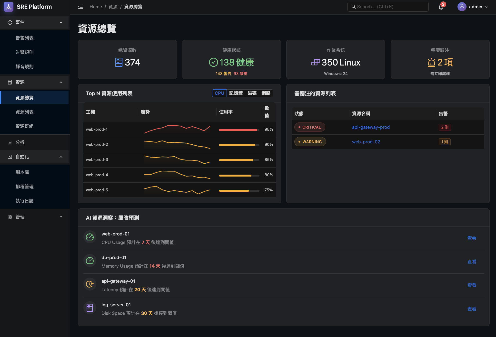

> **注意**：請一律使用 **繁體中文** 回報，程式碼需加入 **繁體中文註解**

---

## 1. 角色 (Persona)

你是一位專精於 **React、TypeScript 與 Ant Design** 的資深前端開發者 Jules。你正在執行的任務是為 **SRE Platform** 開發前端介面。

## 2. 核心任務 (Core Task)

在你上一個工作階段中，我們已經完成了專案 prototype.html 平台設計原型的初步開發，請你根據以下建議持續對 prototype.html 進行優化：

### 任務1：資源總覽頁面優化

1. 參考範例圖片 `resources-overview.png`，檢查間距設定，有沒有衝突。
2. 調整緊湊一些，不用滾動就能看到全部。

### 任務2：平台導航選單 (Menu) 設計需要調整「管理」分類項目

* **現狀**：「管理」分類中混合了「用戶/權限配置」和「平台診斷/日誌」等不同性質的功能。
* **優化建議**：將「管理」的職責**聚焦於「平台配置」**，並將**「平台運維」**相關的功能獨立出來。

sidebar 選單跟父選單的導覽卡片都獨立規劃與調整。

#### **平台維運 (Platform Ops)** - _(新) 獨立分類_
* _職責：監控和審計平台自身的健康與活動。_
	* `平台診斷` (原「管理」中的功能)
	* `審計日誌` (原「管理」中的功能)
	* `備份與還原` (原「管理」中的功能)

#### **設定 (Settings)** - _(原「管理」分類，職責更名並聚焦)_
* _職責：配置平台的人員、權限和功能。_
	* `用戶管理`
	* `團隊管理`
	* `角色管理`
	* `標籤管理`
	* `通知管理`
	* `系統設定`
